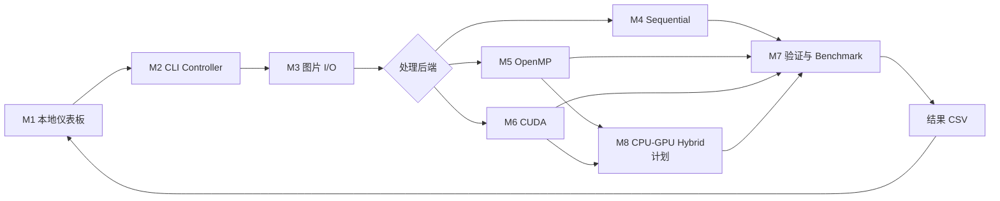

# ParallelPix

> 基于 OpenMP 与 CUDA 的电商商品图片并行处理课程项目

## 构建与运行

### C++ CLI 与 M2～M7 Benchmark

项目通过 vcpkg manifest 固定 OpenCV 的 JPEG/PNG 最小依赖。先安装或使用 Visual Studio 2022 自带的 vcpkg，并在 Visual Studio 2022 Developer PowerShell 中执行：

```powershell
$env:VCPKG_ROOT = "<vcpkg-root>"
cmake -S . -B build/m7 -G "Visual Studio 17 2022" -A x64 `
  "-DCMAKE_TOOLCHAIN_FILE=$env:VCPKG_ROOT/scripts/buildsystems/vcpkg.cmake"
cmake --build build/m7 --config Debug
ctest --test-dir build/m7 -C Debug --output-on-failure
.\build\m7\Debug\parallelpix.exe --help
```

构建会生成 M2 CLI、M3 图片 I/O、M4 Sequential、M5 OpenMP、M7 Benchmark 静态库及对应测试。默认 `PARALLELPIX_CUDA=AUTO`：检测到 CUDA Toolkit 时同时构建 M6 和 `parallelpix_m6_tests`，未检测到时生成 CPU-only 工程。Sequential/OpenMP/CUDA 三种后端均已接入真实 Pipeline，共享预热、正式测量、PNG 验证、统计并写入 M1 所需的 27 列 CSV；CUDA 额外记录 H2D、Kernel、D2H 时间。CUDA 不可用时对应实验计为跳过，CLI 保留 CPU 结果并返回部分成功。

目标 RTX 50 系 Blackwell GPU 使用 CUDA Toolkit 12.8 和架构 120。显式 CUDA 构建示例：

```powershell
$env:VCPKG_ROOT = "<vcpkg-root>"
$env:CUDA_PATH = "C:\Program Files\NVIDIA GPU Computing Toolkit\CUDA\v12.8"
cmake -S . -B build/m6-cuda -G "Visual Studio 17 2022" -A x64 `
  -T "cuda=$env:CUDA_PATH" `
  "-DCMAKE_TOOLCHAIN_FILE=$env:VCPKG_ROOT/scripts/buildsystems/vcpkg.cmake" `
  -DPARALLELPIX_CUDA=ON `
  -DCMAKE_CUDA_ARCHITECTURES=120
cmake --build build/m6-cuda --config Release
ctest --test-dir build/m6-cuda -C Release --output-on-failure
```

`PARALLELPIX_CUDA=ON` 在缺少 Toolkit 时配置失败；`OFF` 明确生成 CPU-only 工程。Windows CUDA 构建会把所需 `cudart64_12.dll` 放到可执行文件目录。

### M1 本地仪表板

M1 仪表板使用 Python 3.12。首次运行：

```powershell
py -3.12 -m venv .venv
.\.venv\Scripts\python.exe -m pip install -r requirements.txt
.\.venv\Scripts\python.exe -m streamlit run tools/dashboard.py
```

默认进入明确标记的 Demo 模式，不需要已编译的 C++ CLI。切换到 `Local CLI` 后，页面默认使用 `build/m6-cuda-vs/Release/parallelpix.exe`，并按 [M1 设计契约](docs/design/M1本地性能仪表板设计.md) 启动 M2/M7 真实 Benchmark。运行期间只显示低频节流的文本状态；处理轨迹在计时结束后记录，并在 Benchmark 完成后作为静态结果展示，不提供实时绘图模式。

Windows 下也可以直接双击根目录的 `start_dashboard.bat`：脚本会创建或复用 `.venv`、修复失效的 Python 3.12 虚拟环境、安装固定版本依赖并启动页面。只检查和修复运行环境而不启动页面时，可执行：

```powershell
.\start_dashboard.bat --check-only
```

运行自动化测试：

```powershell
.\.venv\Scripts\python.exe -m pip install -r requirements-dev.txt
.\.venv\Scripts\python.exe -m pytest -q
```

## 架构概览

- **技术栈**：C++17、OpenMP、CUDA、OpenCV、CMake、Python、Streamlit
- **架构模式**：本地 Streamlit 仪表板 + C++ CLI Controller + 可替换计算后端
- **核心模块**：M1 本地仪表板、M2 CLI Controller、M3 图片 I/O、M4 Sequential、M5 OpenMP、M6 CUDA、M7 验证与 Benchmark，以及计划中的 M8 CPU-GPU Hybrid
- **详细设计**：见 [`docs/tech/技术架构文档.md`](docs/tech/技术架构文档.md)



若 Markdown 阅读器不渲染 Mermaid，可直接阅读下方的文本版流程图。

```text
M1 本地性能仪表板
        │ 启动 Benchmark、展示结果
        ▼
M2 CLI Controller 与任务编排
        │ 解析参数、生成实验计划
        ▼
M3 图片数据 I/O
        │ 读取、校验、解码图片
        ▼
M4 Sequential ───────────────────────┐
M5 OpenMP ─────┬─────────────────────┤
M6 CUDA ───────┴→ M8 Hybrid（计划）──┤
                                      ▼
                         M7 验证、统计与 Benchmark
                  │ 生成结果 CSV
                  ▼
             results/*.csv
                  │ 读取并绘制图表
                  └──────────────────────► M1 本地性能仪表板
```

这是打开 Markdown 文件即可阅读的系统总览；图片处理步骤、后端调用细节、数据字段和异常分支见[技术架构文档](docs/tech/技术架构文档.md)。

## 目录结构与模块映射

### 先看结论

- **M1 本地性能仪表板**：全部 Python 页面代码在 `tools/parallelpix_dashboard/`；启动入口是 `tools/dashboard.py`。
- **M2 CLI Controller**：按 `cli`、`planning`、`controller`、`pipeline` 四个子模块拆分；实现位于 `src/`，公共接口位于 `include/parallelpix/`。
- **M3 图片数据 I/O**：已作为独立 `parallelpix_io` 库实现并由 M7 真实 Pipeline 调用。
- **M4 Sequential**：公共像素语义和单线程后端已实现并注册到 M7。
- **M5 OpenMP**：图片级优先、行级回退的多核后端已实现并注册到 M7。
- **M6 CUDA**：已完成条件构建、共享预检、连续批处理、融合 Kernel、显存复用/回退和分阶段计时。
- **M7 Benchmark Core**：已完成三后端预检、预热、计时、PNG 验证、统计、原子 CSV 和后端降级；M5/M6 统一测试待执行。
- **M8 CPU-GPU Hybrid**：设计与实施计划已建立；等待并发组合 OpenMP/CUDA，不属于当前已实现功能。

### 当前实际目录

下面的树状图只展示已存在的、与开发相关的目录和文件；`.venv/`、`build/`、`.pytest_cache/`、`.tmp/` 等本机生成目录不纳入项目结构。

```text
ParallelPix/
├── CMakeLists.txt                  # C++17 构建、M2～M7 目标和 C++ 测试注册
├── requirements.txt                # M1 运行依赖
├── requirements-dev.txt            # M1 测试依赖
├── start_dashboard.bat             # Windows 下创建环境并启动 M1
├── include/
│   └── parallelpix/                # 公共 C++ 接口
│       ├── cli/cli.hpp             # 命令行请求、后端和 CSV 模型
│       ├── planning/benchmark_plan.hpp # 实验计划与单项实验模型
│       ├── controller/controller.hpp # Controller、日志与退出码接口
│       ├── pipeline/pipeline_factory.hpp # Pipeline 创建接口
│       ├── common/image.hpp         # M3～M6 共用 Image 与 Watermark 模型
│       ├── common/processing.hpp    # M4～M6 共用配置、几何和像素语义
│       ├── io/image_io.hpp          # M3 扫描、解码、批次和 PNG 写出接口
│       ├── sequential/processor.hpp # M4 单线程批处理接口
│       ├── openmp/                  # M5 OpenMP 调度与批处理接口
│       ├── cuda/processor.hpp       # M6 CUDA 后端公共接口
│       └── benchmark/               # M7 后端、验证、统计、报告和 Runner 接口
├── src/
│   ├── cli/
│   │   ├── main.cpp                # 可执行程序入口与 UTF-8 参数转换
│   │   └── cli_parser.cpp          # 命令行解析与语义校验
│   ├── planning/benchmark_plan.cpp # 由请求生成实验矩阵
│   ├── controller/controller.cpp   # 编排、日志和退出码
│   ├── pipeline/benchmark_pipeline.cpp # M7 真实 Pipeline 工厂
│   ├── common/{geometry,resize,effects}/ # M4～M6 共享像素语义
│   ├── io/{catalog,decode,encode}/ # M3 扫描、解码、批次和 PNG 输出
│   ├── sequential/processor/       # M4 单线程处理流水线
│   ├── openmp/{scheduling,processor}/ # M5 图片级/行级 OpenMP 并行处理
│   ├── cuda/{runtime,processor,kernels}/ # M6 运行时、批处理和融合 Kernel
│   └── benchmark/{runner,validation,reporting,statistics}/ # 已实现的 M7
├── tools/
│   ├── dashboard.py                # M1 Streamlit 启动入口
│   ├── download_*.py               # 下载公开商品图片样本的辅助脚本
│   └── parallelpix_dashboard/      # M1 仪表板实现
│       ├── page.py                 # 页面组装、状态初始化和运行流程
│       ├── sidebar.py              # 参数表单与运行按钮
│       ├── models.py               # 请求、运行模式和运行状态模型
│       ├── validation.py           # 页面参数校验
│       ├── runners.py              # Demo / Local CLI 执行器
│       ├── results.py              # Benchmark CSV 读取与校验
│       ├── charts.py、views.py     # 图表与结果视图
│       ├── components.py           # 可复用页面组件
│       ├── i18n.py                 # 中英文案
│       ├── styles.py               # Streamlit 样式
│       ├── preview.py              # 图片预览
│       └── assets/demo_results.csv # Demo 模式的示例结果
├── tests/
│   ├── cpp/
│   │   ├── cli/                    # M2 CLI Parser 测试
│   │   ├── planning/               # M2 实验矩阵测试
│   │   ├── controller/             # M2 编排与退出码测试
│   │   ├── pipeline/               # M2 Pipeline 工厂测试
│   │   ├── common/                  # 共享几何与像素算法测试
│   │   ├── io/                      # M3 I/O 正常与异常测试
│   │   ├── sequential/              # M4 基线与 M3 集成测试
│   │   ├── openmp/                  # M5 并行一致性、调度与线程数测试
│   │   ├── cuda/                    # M6 像素、运行时、显存回退和设备测试
│   │   ├── benchmark/               # M7 验证、指标、Runner 和 CSV 测试
│   │   └── test_main.cpp、test_support.hpp # 共享 C++ 测试入口与断言
│   ├── powershell/assert_cli_process.ps1 # M2 真实进程断言
│   ├── fixtures/fake_cli.py        # M1 调用 CLI 的测试替身
│   ├── conftest.py                 # Python 测试公共夹具
│   └── test_*.py                   # M1 模型、校验、结果、Runner、样式和启动测试
├── data/                           # 输入数据：图片清单、样本目录和水印
├── output/                         # 本地处理图片输出；不提交生成内容
├── results/                        # 本地 Benchmark CSV 输出；不提交生成内容
└── docs/                           # 需求、设计、计划、技术说明和测试记录
```

### 模块状态与代码位置

| 模块 | 当前实现位置 | 对应测试 | 状态 |
|------|--------------|----------|------|
| M1 本地性能仪表板 | `tools/dashboard.py`、`tools/parallelpix_dashboard/` | `tests/test_dashboard_app.py`、`tests/test_*.py` | 已实现；支持 Demo 与 Local CLI 模式 |
| M2 CLI Controller 与任务编排 | `src/{cli,planning,controller,pipeline}/`、`include/parallelpix/{cli,planning,controller,pipeline}/` | `tests/cpp/{cli,planning,controller,pipeline}/`、`tests/powershell/` | 已实现；负责解析、校验、计划、日志和退出码 |
| M3 图片数据 I/O | `src/io/{catalog,decode,encode}/`、`include/parallelpix/{common,io}/` | `tests/cpp/io/`、`tests/fixtures/{images,watermarks}/` | 已实现并由 M7 Pipeline 调用 |
| M4 Sequential 基线 | `src/common/{geometry,resize,effects}/`、`src/sequential/processor/`、`include/parallelpix/{common,sequential}/` | `tests/cpp/{common,sequential}/` | 已实现、接入 M7 并作为性能与正确性基准 |
| M5 OpenMP 后端 | `src/openmp/{scheduling,processor}/`、`include/parallelpix/openmp/` | `tests/cpp/openmp/` | 已实现并接入 M7；测试代码待统一执行 |
| M6 CUDA 后端 | `src/cuda/{runtime,processor,kernels}/`、`include/parallelpix/cuda/` | `tests/cpp/cuda/` | 已实现并接入 M7；支持分阶段计时和显存减半重试 |
| M7 验证与 Benchmark | `src/benchmark/{runner,validation,reporting,statistics}/`、`include/parallelpix/benchmark/` | `tests/cpp/benchmark/`、真实进程测试 | 三后端代码闭环已完成；待统一回归与性能实验 |
| M8 CPU-GPU Hybrid | 计划落位 `src/hybrid/`、`include/parallelpix/hybrid/` | 计划新增 `tests/cpp/hybrid/` | 已完成设计；等待 M5 |

### CUDA 维护约定

M5 与 M6 均在既有目录中维护，不在 `src/cli/`、`src/controller/` 或模块外目录插入业务实现。共享像素语义和批次预检继续放在 `common/`；后端仅调用公共模型并实现各自计算策略，再注册到 M7 `IBackendExecutor`。既有 CLI 与 27 列 CSV 契约保持不变。M8 作为后续独立接口版本，按其设计受控新增 Hybrid 参数和第28列 `hybrid_cpu_share`，同时保持旧 CSV 可读。

## 编码约定

- **Git**：不在 `main`/`master` 直接工作，使用 `feature/描述-MMDD` 分支
- **文档**：项目文档统一维护在 `docs/`
- **核心算法**：OpenCV 只用于解码、编码和内存容器，像素处理由项目自行实现
- **测试**：按 M1～M8 模块维护正确性、异常和性能测试记录

## 外部依赖

| 依赖 | 用途 |
|------|------|
| Visual Studio 2022、CMake、vcpkg | 构建 C++17 模块并按 manifest 获取依赖 |
| OpenCV core/imgcodecs | M3 图片解码、编码和临时数据容器 |
| OpenMP | 多核 CPU 并行处理 |
| CUDA Toolkit 12.8 | Blackwell GPU 并行处理、Runtime 与 Event 计时 |
| Streamlit、Pandas、Plotly | 本地性能仪表板与图表 |

## 文档导航

- **开发计划** → [`docs/plan/`](docs/plan/)
- **需求与设计** → [`docs/design/`](docs/design/)
- **技术文档** → [`docs/tech/`](docs/tech/)
- **测试记录** → [`docs/test/`](docs/test/)
完整文档索引见 [`docs/README.md`](docs/README.md)
