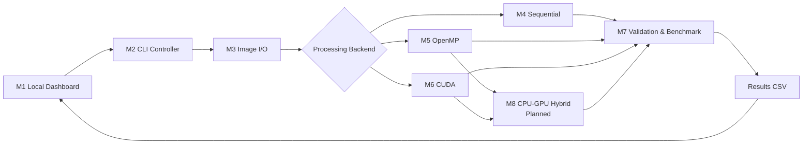

# ParallelPix

> A course project for parallel e-commerce product image processing with OpenMP and CUDA

[Chinese](README.md) | English

## Build and Run

### C++ CLI and M2-M7 Benchmarks

The project uses a vcpkg manifest to pin the minimal OpenCV dependencies required for JPEG and PNG support. Install vcpkg, or use the copy bundled with Visual Studio 2022, then run the following commands in a Visual Studio 2022 Developer PowerShell:

```powershell
$env:VCPKG_ROOT = "<vcpkg-root>"
cmake -S . -B build/m7 -G "Visual Studio 17 2022" -A x64 `
  "-DCMAKE_TOOLCHAIN_FILE=$env:VCPKG_ROOT/scripts/buildsystems/vcpkg.cmake"
cmake --build build/m7 --config Debug
ctest --test-dir build/m7 -C Debug --output-on-failure
.\build\m7\Debug\parallelpix.exe --help
```

The build produces the M2 CLI, M3 image I/O, M4 Sequential, M5 OpenMP, and M7 Benchmark static libraries together with their tests. `PARALLELPIX_CUDA` defaults to `AUTO`: when a CUDA Toolkit is detected, M6 and `parallelpix_m6_tests` are built as well; otherwise, CMake generates a CPU-only project.

The Sequential, OpenMP, and CUDA backends all run through the real processing pipeline. They share warm-up, measurement, PNG validation, statistics, and the 27-column CSV output consumed by M1. CUDA additionally reports Host-to-Device, Kernel, and Device-to-Host timings. When CUDA is unavailable, the corresponding experiments are skipped while the CLI preserves CPU results and returns partial success.

For an RTX 50-series Blackwell GPU, use CUDA Toolkit 12.8 and compute architecture 120:

```powershell
$env:VCPKG_ROOT = "<vcpkg-root>"
$env:CUDA_PATH = "C:\Program Files\NVIDIA GPU Computing Toolkit\CUDA\v12.8"
cmake -S . -B build/m6-cuda -G "Visual Studio 17 2022" -A x64 `
  -T "cuda=$env:CUDA_PATH" `
  "-DCMAKE_TOOLCHAIN_FILE=$env:VCPKG_ROOT/scripts/buildsystems/vcpkg.cmake" `
  -DPARALLELPIX_CUDA=ON `
  -DCMAKE_CUDA_ARCHITECTURES=120
cmake --build build/m6-cuda --config Release
ctest --test-dir build/m6-cuda -C Release --output-on-failure
```

`PARALLELPIX_CUDA=ON` fails during configuration if the Toolkit is missing, while `OFF` explicitly creates a CPU-only project. On Windows, a CUDA build copies the required `cudart64_12.dll` into the executable directory.

### M1 Local Dashboard

The M1 dashboard requires Python 3.12. For the first run:

```powershell
py -3.12 -m venv .venv
.\.venv\Scripts\python.exe -m pip install -r requirements.txt
.\.venv\Scripts\python.exe -m streamlit run tools/dashboard.py
```

The dashboard starts in a clearly labelled Demo mode and does not require a compiled C++ CLI. In `Local CLI` mode, it uses `build/m6-cuda-vs/Release/parallelpix.exe` by default and launches the real M2/M7 benchmark according to the [M1 design contract](docs/design/M1本地性能仪表板设计.md). While a benchmark is running, the UI shows only throttled text status updates. Processing traces are recorded after timing finishes and displayed as static results when the complete benchmark ends.

On Windows, you can also double-click `start_dashboard.bat`. The script creates or reuses `.venv`, repairs an invalid Python 3.12 virtual environment, installs pinned dependencies, and starts the dashboard. To check and repair the environment without starting the UI:

```powershell
.\start_dashboard.bat --check-only
```

Run the automated Python tests with:

```powershell
.\.venv\Scripts\python.exe -m pip install -r requirements-dev.txt
.\.venv\Scripts\python.exe -m pytest -q
```

## Architecture Overview

- **Technology stack:** C++17, OpenMP, CUDA, OpenCV, CMake, Python, and Streamlit
- **Architecture:** local Streamlit dashboard + C++ CLI controller + interchangeable compute backends
- **Core modules:** M1 Local Dashboard, M2 CLI Controller, M3 Image I/O, M4 Sequential, M5 OpenMP, M6 CUDA, M7 Validation and Benchmarking, and the planned M8 CPU-GPU Hybrid backend
- **Detailed design:** see [`docs/tech/system-architecture-en.md`](docs/tech/system-architecture-en.md)



If your Markdown viewer does not render Mermaid, use the text version below:

```text
M1 Local Performance Dashboard
        │ launches benchmarks and displays results
        ▼
M2 CLI Controller and Task Orchestration
        │ parses arguments and creates experiment plans
        ▼
M3 Image I/O
        │ scans, validates, and decodes images
        ▼
M4 Sequential ───────────────────────┐
M5 OpenMP ─────┬─────────────────────┤
M6 CUDA ───────┴→ M8 Hybrid (planned)┤
                                      ▼
                         M7 Validation and Benchmarking
                  │ writes results CSV
                  ▼
             results/*.csv
                  │ read and visualized by
                  └──────────────────────► M1 Local Dashboard
```

## Directory Structure and Module Mapping

### Key Takeaways

- **M1 Local Performance Dashboard:** all Python page code is under `tools/parallelpix_dashboard/`; the launcher is `tools/dashboard.py`.
- **M2 CLI Controller:** split into the `cli`, `planning`, `controller`, and `pipeline` submodules; implementations are under `src/` and public interfaces are under `include/parallelpix/`.
- **M3 Image I/O:** implemented as the independent `parallelpix_io` library and called by the real M7 pipeline.
- **M4 Sequential:** the shared pixel semantics and single-threaded backend are implemented and registered with M7.
- **M5 OpenMP:** the multi-core backend uses image-level parallelism first and row-level parallelism as a fallback; it is registered with M7.
- **M6 CUDA:** conditional builds, shared preflight checks, contiguous batching, a fused Kernel, GPU-memory reuse/fallback, and staged timing are implemented.
- **M7 Benchmark Core:** three-backend preflight checks, warm-ups, timing, PNG validation, statistics, atomic CSV output, and backend degradation are implemented; the unified M5/M6 test run is still pending.
- **M8 CPU-GPU Hybrid:** the design and implementation plan exist; concurrent OpenMP/CUDA execution has not yet been implemented.

### Current Repository Layout

```text
ParallelPix/
├── CMakeLists.txt                  # C++17 build, M2-M7 targets, and C++ test registration
├── requirements.txt                # M1 runtime dependencies
├── requirements-dev.txt            # M1 test dependencies
├── start_dashboard.bat             # Creates the environment and starts M1 on Windows
├── include/
│   └── parallelpix/                # Public C++ interfaces
│       ├── cli/cli.hpp             # Command request, backend, and CSV models
│       ├── planning/benchmark_plan.hpp # Experiment-plan and individual-experiment models
│       ├── controller/controller.hpp # Controller, logging, and exit-code interfaces
│       ├── pipeline/pipeline_factory.hpp # Pipeline creation interface
│       ├── common/image.hpp         # Image and Watermark models shared by M3-M6
│       ├── common/processing.hpp    # Configuration, geometry, and pixel semantics shared by M4-M6
│       ├── io/image_io.hpp          # M3 scanning, decoding, batching, and PNG-output interfaces
│       ├── sequential/processor.hpp # M4 single-threaded batch-processing interface
│       ├── openmp/                  # M5 OpenMP scheduling and batch-processing interfaces
│       ├── cuda/processor.hpp       # Public M6 CUDA backend interface
│       └── benchmark/               # M7 backend, validation, statistics, reporting, and Runner interfaces
├── src/
│   ├── cli/
│   │   ├── main.cpp                # Executable entry point and UTF-8 argument conversion
│   │   └── cli_parser.cpp          # Command-line parsing and semantic validation
│   ├── planning/benchmark_plan.cpp # Generates an experiment matrix from a request
│   ├── controller/controller.cpp   # Orchestration, logging, and exit codes
│   ├── pipeline/benchmark_pipeline.cpp # Real M7 Pipeline factory
│   ├── common/{geometry,resize,effects}/ # Pixel semantics shared by M4-M6
│   ├── io/{catalog,decode,encode}/ # M3 scanning, decoding, batching, and PNG output
│   ├── sequential/processor/       # M4 single-threaded processing pipeline
│   ├── openmp/{scheduling,processor}/ # M5 image-level/row-level OpenMP processing
│   ├── cuda/{runtime,processor,kernels}/ # M6 runtime, batching, and fused Kernel
│   └── benchmark/{runner,validation,reporting,statistics}/ # Implemented M7
├── tools/
│   ├── dashboard.py                # M1 Streamlit launcher
│   ├── download_*.py               # Helpers for downloading public product-image samples
│   └── parallelpix_dashboard/      # M1 dashboard implementation
│       ├── page.py                 # Page composition, state initialization, and run flow
│       ├── sidebar.py              # Parameter form and Run button
│       ├── models.py               # Request, run-mode, and run-state models
│       ├── validation.py           # Page-parameter validation
│       ├── runners.py              # Demo / Local CLI runners
│       ├── results.py              # Benchmark CSV loading and validation
│       ├── charts.py, views.py     # Charts and result views
│       ├── components.py           # Reusable page components
│       ├── i18n.py                 # Chinese and English UI copy
│       ├── styles.py               # Streamlit styles
│       ├── preview.py              # Image preview
│       └── assets/demo_results.csv # Demo-mode sample results
├── tests/
│   ├── cpp/
│   │   ├── cli/                    # M2 CLI Parser tests
│   │   ├── planning/               # M2 experiment-matrix tests
│   │   ├── controller/             # M2 orchestration and exit-code tests
│   │   ├── pipeline/               # M2 Pipeline-factory tests
│   │   ├── common/                 # Shared geometry and pixel-algorithm tests
│   │   ├── io/                     # M3 I/O success and failure tests
│   │   ├── sequential/             # M4 baseline and M3 integration tests
│   │   ├── openmp/                 # M5 consistency, scheduling, and thread-count tests
│   │   ├── cuda/                   # M6 pixel, runtime, memory-fallback, and device tests
│   │   ├── benchmark/              # M7 validation, metrics, Runner, and CSV tests
│   │   └── test_main.cpp, test_support.hpp # Shared C++ test entry point and assertions
│   ├── powershell/assert_cli_process.ps1 # M2 real-process assertions
│   ├── fixtures/fake_cli.py        # Test double for M1 CLI invocation
│   ├── conftest.py                 # Shared Python test fixtures
│   └── test_*.py                   # M1 model, validation, result, Runner, style, and startup tests
├── data/                           # Input data: image lists, sample directories, and watermark
├── output/                         # Local processed-image output; generated content is not committed
├── results/                        # Local Benchmark CSV output; generated content is not committed
└── docs/                           # Requirements, designs, plans, technical notes, and test records
```

Locally generated directories such as `.venv/`, `build/`, `.pytest_cache/`, and `.tmp/` are intentionally omitted from this overview.

### Module Status and Source Locations

| Module | Implementation | Tests | Status |
|---|---|---|---|
| M1 Local Dashboard | `tools/dashboard.py`, `tools/parallelpix_dashboard/` | `tests/test_dashboard_app.py`, `tests/test_*.py` | Implemented; supports Demo and Local CLI modes |
| M2 CLI Controller and orchestration | `src/{cli,planning,controller,pipeline}/`, `include/parallelpix/{cli,planning,controller,pipeline}/` | `tests/cpp/{cli,planning,controller,pipeline}/`, `tests/powershell/` | Implemented; handles parsing, validation, planning, logging, and exit codes |
| M3 Image I/O | `src/io/{catalog,decode,encode}/`, `include/parallelpix/{common,io}/` | `tests/cpp/io/` | Implemented and used by the real M7 pipeline |
| M4 Sequential baseline | `src/common/{geometry,resize,effects}/`, `src/sequential/processor/` | `tests/cpp/{common,sequential}/` | Implemented as the correctness and performance baseline |
| M5 OpenMP backend | `src/openmp/{scheduling,processor}/`, `include/parallelpix/openmp/` | `tests/cpp/openmp/` | Implemented and integrated into M7; the test code awaits the unified test run |
| M6 CUDA backend | `src/cuda/{runtime,processor,kernels}/`, `include/parallelpix/cuda/` | `tests/cpp/cuda/` | Implemented and integrated into M7; supports staged timing and one retry with a halved batch size |
| M7 Validation and Benchmarking | `src/benchmark/{runner,validation,reporting,statistics}/`, `include/parallelpix/benchmark/` | `tests/cpp/benchmark/` and real-process tests | The three-backend code path is complete; unified regression and performance experiments are pending |
| M8 CPU-GPU Hybrid | planned under `src/hybrid/`, `include/parallelpix/hybrid/` | planned under `tests/cpp/hybrid/` | Design complete; waiting for M5 |

### CUDA Maintenance Conventions

M5 and M6 remain within their existing module directories. Business logic must not be inserted into `src/cli/`, `src/controller/`, or unrelated directories. Shared pixel semantics and batch preflight checks stay in `common/`; each backend calls the shared model, implements only its own compute strategy, and registers with M7 through `IBackendExecutor`. The existing CLI contract and 27-column CSV schema remain unchanged. M8 is a later, independent interface version: its design adds the Hybrid parameters and the 28th column, `hybrid_cpu_share`, while keeping older CSV files readable.

## Development Conventions

- **Git:** work on `feature/description-MMDD` branches, never directly on `main` or `master`
- **Documentation:** keep project documentation under `docs/`
- **Core algorithms:** use OpenCV only for decoding, encoding, and memory containers
- **Testing:** maintain correctness, error-path, and performance coverage by module

## External Dependencies

| Dependency | Purpose |
|---|---|
| Visual Studio 2022, CMake, vcpkg | Build the C++17 modules and restore manifest dependencies |
| OpenCV core/imgcodecs | Decode and encode images and provide temporary containers |
| OpenMP | Multi-core CPU processing |
| CUDA Toolkit 12.8 | Blackwell GPU execution, runtime APIs, and event timing |
| Streamlit, Pandas, Plotly | Local performance dashboard and charts |

## Documentation

- [Project plans](docs/plan/)
- [Requirements and design](docs/design/)
- [Technical documentation](docs/tech/)
- [Test records](docs/test/)

See the [complete documentation index](docs/README.md).
