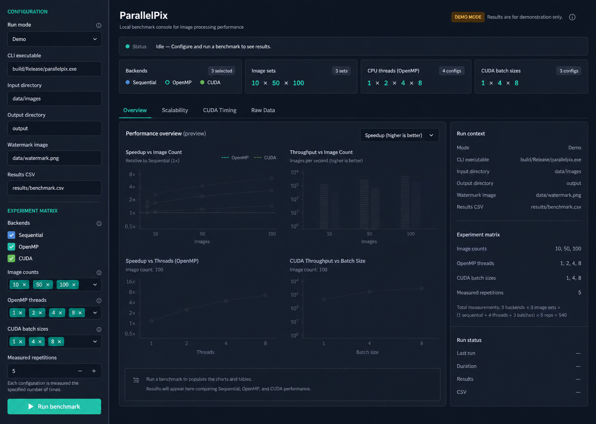

# M1 本地性能仪表板界面美化设计

## 1. 设计结论

本次采用 Product Design 第 3 套方案“数据优先的实验工作台”。界面继续使用 Streamlit 和现有深色主题，不改变 Benchmark 请求、Runner、CSV 契约、结果计算或四个结果标签页的功能，仅重组视觉层级、页面密度和状态表达。

核心目标：

- 让用户在首屏快速确认实验矩阵、运行状态和结果入口；
- 缩短侧栏的视觉长度，减少当前页面“左侧拥挤、右侧空旷”的失衡；
- 保留本地工程工具的克制感，不引入营销式大标题、装饰插画或多层卡片；
- 让空状态、Demo 状态、成功、部分成功和失败状态都拥有清晰且一致的表达。

## 2. 信息架构

### 2.1 顶部区域

顶部使用紧凑标题区：

- 主标题：`ParallelPix`
- 副标题：`Local benchmark console for image-processing performance`
- 右侧状态：Demo 模式显示琥珀色 `DEMO MODE` 标签和说明；Local CLI 模式显示中性的 `LOCAL CLI` 标签。
- 右上角提供 `EN / 中` 语言切换，默认英文；切换后立即刷新应用自有文案，并在当前 Streamlit 会话内保持选择。

标题下方保留单行运行状态条。状态条包含状态圆点、状态名称和当前提示，不再用占据整行的大面积蓝色提示框表达普通空闲状态。

语言切换覆盖标题、副标题、侧栏标签、帮助文案、状态说明、摘要、标签页、指标、空状态、下载按钮及应用生成的错误提示。CLI 原始输出、文件路径、run_id、CSV 字段和技术名词 `Sequential`、`OpenMP`、`CUDA` 保持原文，避免改变外部契约或排障信息。

### 2.2 左侧配置栏

侧栏固定为紧凑的 272px 宽度，内容分为两个视觉分组：

1. `CONFIGURATION`
   - Run mode
   - CLI executable
   - Input directory
   - Output directory
   - Watermark image
   - Results CSV
2. `EXPERIMENT MATRIX`
   - Backends
   - Image counts
   - OpenMP threads
   - CUDA batch sizes
   - Measured repetitions

分组使用小号大写标题、细分隔线和稳定的垂直间距，不把每个字段包进独立卡片。`Run benchmark` 是侧栏唯一的主按钮，保持高对比度并位于配置末尾。

Demo 模式下继续禁用 CLI executable。Backends 使用三个真实复选框；选中 OpenMP 或 CUDA 时自动选中并锁定 Sequential 基线。图片数量、OpenMP 线程和 CUDA 批大小继续使用紧凑多选标签，既有表单键和参数范围保持不变。

### 2.3 实验矩阵摘要

主区状态条下方新增四列轻量摘要：

- Backends
- Image sets
- CPU threads (OpenMP)
- CUDA batch sizes

摘要直接读取当前表单选择，不写入 Session State 的新业务字段，也不参与参数校验。每列只显示标签、数量和已选值；使用细边框或分隔线完成分组，不使用高阴影卡片。

当某个后端未选择时，对应摘要显示 `Not selected`，避免让用户误以为该配置会被执行。

### 2.4 结果工作区

结果区域保留现有四个标签页：

- Overview
- Scalability
- CUDA Timing
- Raw Data

Idle 状态显示明确标注为 `Preview / 未测量` 的四张示意图表，固定读取内置 `demo_results.csv` 的最新样例。预览与真实结果使用相同的图表语义和 2×2 布局：计算时间、加速比、吞吐量，以及优先展示 CUDA 批大小吞吐量（无 CUDA 时展示 OpenMP 线程扩展）。预览数据只服务于布局和图表理解，不写入 `results_frame`，不进入运行历史，不生成真实指标、run_id 或 CSV 下载，也不触发 Runner。运行 Benchmark 后，预览工作区由真实 Demo 或 Local CLI 结果完整替换。

有结果时：

- Benchmark run 选择器与只读 CSV 来源放在结果区顶部；
- 四个核心指标保持为一行轻量指标单元；
- Overview 先选择一个图片数量，再以 Sequential、OpenMP 线程配置和 CUDA 批大小作为横轴，展示计算时间、加速比和吞吐量；图片数量的规模趋势由独立图表表达，不作为主对比图的横轴；
- Scalability、CUDA Timing 和 Raw Data 保持现有职责；
- 宽屏下图表区占据主要空间，运行上下文作为右侧窄栏；窄屏下运行上下文移动到图表下方。

运行上下文展示模式、路径、实验矩阵、总测量次数公式和 Run status。Idle 使用破折号；真实结果填充 run_id、时间戳、结果数量和 CSV 来源，不新增后端接口或性能计算字段。

## 3. 视觉系统

### 3.1 颜色

| Token | 建议值 | 用途 |
| --- | --- | --- |
| Page background | `#08111F` | 主背景 |
| Sidebar background | `#0D1726` | 侧栏 |
| Surface | `#101C2C` | 输入框、状态区和图表承载面 |
| Border | `#243247` | 分隔线与轻边框 |
| Text primary | `#F1F5F9` | 标题与主要数值 |
| Text secondary | `#94A3B8` | 说明和次要标签 |
| Accent | `#2DD4BF` | 主按钮、选中项和焦点 |
| OpenMP | `#60A5FA` | OpenMP 图表 |
| CUDA | `#4ADE80` | CUDA 图表 |
| Sequential | `#94A3B8` | Sequential 图表 |
| Demo warning | `#F59E0B` | Demo 标签和提示 |
| Error | `#F87171` | 失败与校验错误 |

颜色不能作为唯一的状态区分方式；状态同时包含文字或图标。

### 3.2 字体与间距

- 使用 Streamlit 可稳定加载的系统无衬线字体栈；
- 正文基准为 14～16px，页面标题不超过 34px；
- 数值和路径优先使用等宽数字或系统等宽字体；
- 主区采用 8px 间距网格，常用间距为 8、12、16、24 和 32px；
- 圆角控制在 6～8px；
- 阴影仅用于必须表达浮层层级的组件，普通区域不使用阴影。

### 3.3 图表

Plotly 图表统一使用透明背景、浅色网格线和一致的后端颜色。图例、标题和坐标轴字号适配暗色主题，避免 Plotly 默认白底或与页面主题不一致的颜色。

## 4. 状态与交互

| 状态 | 页面表达 |
| --- | --- |
| Idle | 中性状态条；Overview 显示明确标注为未测量的 2×2 Preview 图表，业务结果状态保持为空 |
| Validating | 状态条显示校验中；错误就近展示 |
| Running | 保留实时日志和进度状态，不阻断已有日志行为 |
| Success | 绿色成功状态；自动加载新增 run_id |
| Partial | 琥珀色状态；明确说明部分配置未完成 |
| Failed | 红色状态；默认展开错误日志 |
| Demo | 顶部琥珀色标签；始终说明数据未经测量 |

所有现有控件的键值和 Session State 字段保持兼容，避免破坏现有 AppTest。

语言状态仅用于展示层，不写入 `BenchmarkRequest`，不影响 Runner、CSV 或性能测量。

## 5. 响应式与可访问性

- 忠实对照视口为 `1488 × 1058`，同时验证 `2048 × 1024` 和响应式 `1280 × 720`；
- 在约 1200px 以上保持侧栏与主区并排；
- 更窄视口沿用 Streamlit 可折叠侧栏，主区摘要允许从四列变为两列或单列；
- 交互文字与背景满足至少 WCAG AA 对比度；
- 聚焦态使用清晰的青绿色外框；
- 按钮、选择器和下载操作保留可读标签，不使用只有图标的关键操作；
- 不依赖 hover 才能读取必要信息。

## 6. 实现边界

预计局部修改：

- `tools/parallelpix_dashboard/page.py`：紧凑标题、模式标签和页面骨架；
- `tools/parallelpix_dashboard/sidebar.py`：配置分组与摘要数据返回；
- `tools/parallelpix_dashboard/views.py`：结果区、Preview/真实结果切换和运行上下文；
- `tools/parallelpix_dashboard/preview.py`：只读样例预览数据和四张 Preview 图表；
- `tools/parallelpix_dashboard/components.py`：四张矩阵摘要卡片和扩展 Run context；
- `tools/parallelpix_dashboard/charts.py`：统一暗色图表样式；
- `tools/parallelpix_dashboard/i18n.py`：中英文案和应用消息本地化；
- `tools/parallelpix_dashboard/styles.py`：集中维护 Streamlit CSS 和视觉 token；
- `.streamlit/config.toml`：同步主题色；
- `tests/test_dashboard_app.py`：验证主要标题、状态、标签页、摘要和现有交互；
- `docs/test/M1本地性能仪表板测试.md`：补充视觉与真实页面验证记录。

不修改 Runner、结果计算、CSV Schema、数据库或生产配置，不新增外部字体、图片或网络依赖。

## 7. 验收标准

- 默认 Demo/Idle 页面在 `1488 × 1058` 与目标稿保持同状态、同尺寸布局；
- Idle 首屏包含四张 Preview 图表，且 `results_frame` 仍为 `None`、真实指标数为 0；
- 当前实验矩阵无需滚动到结果区即可确认；
- Demo、Idle、Running、Success、Partial 和 Failed 状态均可区分；
- 四个结果标签页、历史 run 选择、CSV 下载和实时日志功能无回归；
- 右上角可在英文和中文之间切换，当前会话内选择保持稳定；
- 图表背景、文字、图例与后端颜色在暗色主题下统一；
- Streamlit 运行时无新增控制台警告；
- 自动化测试通过，`git diff --check` 通过；
- 使用真实浏览器在默认空状态和 Demo 结果状态下完成截图检查。

## 8. 自检结论

- 未保留未决项或模糊内容；
- 视觉变更与现有 M1 功能边界一致；
- 未引入新业务能力、数据字段或额外页面；
- 实现范围集中在展示层和对应测试、文档；
- 窄屏布局、错误状态和 Demo 数据标识均有明确规则。
