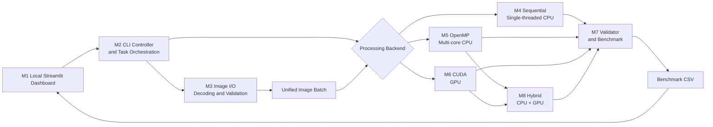

# Technical Architecture Document

[Chinese Technical Architecture Document](技术架构文档.md) | English

## 1. Project Positioning

ParallelPix is a final project for a parallel-computing course. Using cross-border e-commerce product-image standardization as its business scenario, the baseline acceptance scope implements and compares three computing methods on the same batch of images:

1. Single-threaded sequential CPU computing;
2. OpenMP multi-core parallel CPU computing;
3. CUDA parallel GPU computing.

After the three independent backends are complete, M8 further divides the same image batch between OpenMP and CUDA for concurrent execution. It serves as a fourth, optional CPU-GPU Hybrid heterogeneous-computing method.

The core research questions are: when processing product images in batches, how much performance improvement can OpenMP and CUDA achieve over a single-threaded CPU; how do data size, CPU thread count, and GPU data transfer affect the results; and can simultaneous CPU/GPU execution reduce the pure-CUDA time even further?

## 2. Project Scope

The project includes local batch image loading, center cropping, resizing, brightness adjustment, semi-transparent watermarking, output-consistency validation, and performance reporting.

The project does not include a public Web frontend, backend API, database, e-commerce transaction features, AI models, or external services. It includes a Python Streamlit performance dashboard that runs only on the local machine. The dashboard starts the compiled command-line program, displays execution status, and presents CSV results; it is not part of the measured computation. The first version also excludes distributed systems such as Spark, Kafka, and Hadoop. Because OpenMP and CUDA are the two computing components required by the course, their use as a pair should be confirmed with the instructor before implementation. M8 is an optional extension after baseline acceptance and does not replace the independent OpenMP and CUDA results.

## 3. Technology Selection

| Technology | Purpose | Constraint |
|---|---|---|
| C++17 | Shared workflow, data structures, and sequential baseline | All backends share the same data model |
| OpenMP | Shared-memory CPU parallelism | Configurable thread count |
| CUDA C++ | GPU pixel-level parallelism | Requires an NVIDIA GPU |
| OpenCV core/imgcodecs | M3 image decoding, encoding, and temporary containers | Version pinned by vcpkg; not exposed in the public model; ready-made image-processing algorithms are not used |
| CMake | Build management | Unified Release configuration |
| Python, Streamlit, Pandas, Plotly | Local performance dashboard, command launching, and interactive charts | Not involved in the measured computation |

## 4. Overall Architecture



The system follows a "Controller orchestration + shared workflow + interchangeable compute backends" architecture. M2 is responsible only for parameter validation and invocation order. Loading, configuration, validation, timing, and reporting are implemented once. M4-M6 are independent backends responsible for the same pixel calculations. M8 combines M5 and M6 for task-level heterogeneous scheduling, ensuring that all configurations use identical processing semantics.

## 5. Image-Processing Pipeline

```text
Input image
  → calculate the center-crop region
  → resize to a uniform size with bilinear interpolation
  → adjust brightness
  → overlay a semi-transparent watermark in the bottom-right corner
  → output the standardized image
```

- Center cropping calculates only the sampling region and does not create an intermediate file;
- Bilinear resizing is the main computational bottleneck, with every output pixel reading four neighboring input pixels;
- Brightness adjustment multiplies every color channel and clamps it to the 0-255 range;
- The watermark keeps its original dimensions and uses Alpha Blending 32 px from the right and bottom edges;
- The default output size is 1024×1024, the brightness factor is 1.10, and watermark opacity is 0.35;
- Resizing, brightness adjustment, and blending all use nearest-integer rounding and clamp results to 0-255.

## 6. Core Modules

| Module | Responsibility | Dependency |
|---|---|---|
| M1 Local Performance Dashboard UI | Start predefined Benchmark commands, display status, and read CSV charts | Python, Streamlit, Pandas, Plotly |
| M2 CLI Controller and Task Orchestration | Parse and validate parameters, select backends, and orchestrate M3-M8 | C++ |
| M3 Image I/O | Scan, sort, decode, validate, and save images | OpenCV |
| M4 Shared Processing Model and Sequential | Store shared configuration, define processing semantics, and provide the single-threaded baseline | C++ |
| M5 OpenMP Backend | Process images or output rows with multiple CPU cores | OpenMP |
| M6 CUDA Backend | Manage GPU memory, data transfers, Kernels, and CUDA degradation | CUDA |
| M7 Validation and Benchmarking | Compare pixel results, measure execution, calculate statistics, and generate CSV output | C++ |
| M8 CPU-GPU Hybrid | Divide images by ratio, invoke OpenMP/CUDA concurrently, and merge them in their original order | M5, M6, M7 |

Error handling, logging, resource release, and degradation are cross-cutting capabilities. The module where an error occurs produces the specific error, and M2 uniformly propagates it as a log entry and process exit code.

M4 and M6 share batch preflight checks. Their processing entry points are:

```text
prepare_processing_batch(input_images, watermark, config)
  -> BatchPreparationResult

process_batch(input_images, watermark, config)
  -> BatchProcessingResult

cuda::Processor::process_batch(
  input_images, watermark, config, requested_batch_size)
  -> cuda::ProcessingResult
```

M7 is already responsible for selecting a backend according to the experiment configuration, timing it, and wrapping the runtime lifecycle. Sequential and OpenMP are always registered, while M6 is registered when a CUDA compiler and device are available. All three connect through `IBackendExecutor`; statistical or CUDA synchronization interfaces are not introduced into M4. `BackendAvailability` distinguishes between a backend omitted from the build and a backend with no runtime device. `BackendExecution` returns the actual CUDA batch size and optional staged timings to M7.

## 7. Parallel Design

### 7.1 M4 Sequential

- Uses ordinary C++ loops to process one image and one pixel at a time;
- Must not use OpenMP or ready-made OpenCV processing functions;
- The Sequential target does not link OpenMP or OpenCV and does not create worker threads;
- Uses the same compiler optimization level as the OpenMP version;
- Serves as the correctness reference and performance baseline.

### 7.2 M5 OpenMP

- Prefers image-level parallelism, with each thread writing to non-overlapping output memory;
- Can use output-row parallelism when the number of images is small;
- The first version does not use nested parallelism;
- The watermark and configuration are shared read-only;
- Tests 1, 2, 4, 8, and the maximum thread count supported by the device.

### 7.3 M6 CUDA

- Uses `16×16` two-dimensional blocks, with `grid.z` representing images and one GPU thread processing the three BGR channels of one output pixel;
- A single fused Kernel performs half-pixel bilinear sampling, brightness adjustment, and watermark blending;
- Variable-sized inputs and descriptors are packed contiguously, while fixed-size outputs are laid out contiguously;
- A single stream reuses GPU memory for inputs, outputs, descriptors, the watermark, and Alpha;
- CUDA Events separately accumulate Host-to-Device, Kernel, and Device-to-Host time;
- If the first GPU-memory allocation fails, the batch size is halved and the complete operation is retried once from the beginning;
- Every CUDA API call, Kernel launch, and synchronization operation is checked for errors;
- See [M6 CUDA Backend Design](../design/M6%20CUDA后端设计.md) for the complete design.

### 7.4 M8 CPU-GPU Hybrid (Planned)

- Uses images as non-overlapping task units and applies deterministic, evenly interleaved partitioning according to the CPU ratio;
- The CPU branch invokes M5 OpenMP and the GPU branch invokes M6 CUDA, with both branches overlapping in time;
- Preserves original indices and restores input order at the join point;
- If either branch fails, the entire Hybrid configuration fails instead of degrading and pretending to be a pure-backend result;
- Complete wall-clock time covers task partitioning, concurrent execution, and result merging, while CUDA Events still describe only the GPU subset;
- The completed static trace separately displays Hybrid CPU, Hybrid GPU, and overall completion progress;
- See [M8 CPU-GPU Hybrid Backend Design](../design/M8%20CPU-GPU混合后端设计.md) for the complete design.

## 8. Data and Output

All independent backends and Hybrid subtasks use contiguous 8-bit, three-channel BGR data:

```text
Image { width, height, channels, stride, source_path, pixels }
Watermark { BGR color image, alpha plane }
```

`Image` owns a tightly packed pixel array where `stride = width * 3`. M3 decodes ordinary images uniformly into BGR, while the watermark retains a separate Alpha plane. OpenCV types exist only inside the M3 implementation; M4-M6 access pixels through the shared model.

The Benchmark CSV contains at least:

```text
run_id, recorded_at_utc, backend, thread_count, cuda_batch_size,
image_count, input_resolution, output_resolution, warmups, repetitions,
compute_ms, compute_min_ms, compute_max_ms, compute_stddev_ms,
end_to_end_ms, end_to_end_min_ms, end_to_end_max_ms, end_to_end_stddev_ms,
images_per_second, megapixels_per_second, speedup, parallel_efficiency,
validation_passed, max_pixel_error, h2d_ms, kernel_ms, d2h_ms
```

Each row represents one aggregated experiment configuration. `compute_ms` and `end_to_end_ms` are medians. Fields that do not apply to a backend remain empty rather than containing fabricated zero values.

The currently implemented schema has 27 columns. M8 is planned to append `hybrid_cpu_share` as the 28th column. M1 will accept both the old 27-column and new 28-column formats so that existing M6/M7 historical results remain readable.

## 9. Performance Measurement

- Pure compute time starts after image decoding and is used to compare the core algorithms;
- End-to-end time includes scanning, decoding, computation, and encoding; for CUDA it also includes data transfer;
- CPU measurements use `std::chrono::steady_clock`, while CUDA Kernel measurements use CUDA Events;
- Each configuration uses 2 warm-up runs and at least 5 measured runs;
- The main report presents the median and also saves the minimum, maximum, and standard deviation;
- Experiments use Release builds and record CPU, GPU, memory, and toolchain versions.

Calculated metrics:

```text
Speedup = Sequential Time / Parallel Time
Parallel Efficiency = Speedup / OpenMP Thread Count
Images per Second = Image Count / Execution Time
Megapixels per Second = Total Output Pixels / Execution Time / 1,000,000
```

Experiment variables include image count, resolution, OpenMP thread count, CUDA batch size, and the Hybrid CPU workload ratio after M8 is implemented. Raw experiment records and conclusions are archived under `docs/test/`.

## 10. M1 Local Performance Dashboard

- Opens in the local browser through `streamlit run tools/dashboard.py`; it is not deployed as a public Web service;
- Users can select an approved input directory, backend, OpenMP thread count, CUDA batch size, and fixed measurement mode, then start the corresponding CLI Benchmark; the Hybrid CPU ratio is added only after M8 is implemented;
- The page displays subprocess status, standard output, and standard error; after the command finishes, it reloads the results CSV;
- Tables and interactive charts show execution time, speedup, throughput, parallel efficiency, and CUDA H2D, Kernel, and D2H time;
- After M8 is implemented, the completed static trace adds Hybrid CPU/GPU/overall progress and provides an enlarged parallel-backend view that excludes Sequential;
- The dashboard reads CSV data only after the Benchmark finishes and does not participate in measured processing, timing, or metric calculation; performance conclusions are based on the raw CSV written by the C++ Benchmark Runner;
- The CLI must also run independently without the dashboard to support automated testing and troubleshooting during the presentation.

## 11. Correctness and Error Handling

- Sequential output is the reference;
- OpenMP output must match Sequential exactly;
- CUDA permits a maximum absolute error of 1 per channel;
- Correctness comparison uses PNG to avoid JPEG compression differences;
- Runs that fail validation must not be used to publish speedup figures;
- An invalid input directory, image, parameter, or output path produces a clear error and exits with a non-zero status;
- When no CUDA device is available, only the CUDA backend is disabled and CPU backends can still run;
- If CUDA runs out of memory, it retries once with a smaller batch size; if that also fails, the backend terminates;
- If either Hybrid component is unavailable, only Hybrid is skipped; if either branch fails during execution, the whole experiment fails and does not masquerade as a pure-backend result;
- Kernel or data-copy failures are logged and mark the current result as invalid.

## 12. Test Strategy

- Unit tests: crop coordinates, interpolation, clamping, watermark blending, and metric formulas;
- Boundary tests: 1×1, 2×2, non-square, all-black, all-white, and gradient images;
- Consistency tests: process identical input with all three backends and compare each pixel;
- Integration tests: load images from a directory, generate output, and write CSV data;
- Error tests: corrupted images, missing write permission, invalid parameters, and no CUDA device;
- Performance tests: different image counts, resolutions, thread counts, and batch sizes;
- M8 extension tests: task partitioning, CPU/GPU time overlap, merge order, branch errors, CPU ratios, and pure-backend comparisons;
- Dashboard tests: verify that supported parameters start the CLI correctly, errors are displayed after abnormal exits, and CSV data and charts refresh after completion; dashboard-page time is not included in performance results.

Performance tests do not use a fixed speedup threshold as an automated pass condition because results depend on hardware and system load.

## 13. Directory Structure and Module Boundaries

```text
ParallelPix/
├── CMakeLists.txt
├── README.md
├── configs/
├── data/samples/
├── docs/{design,plan,tech,test}/
├── include/parallelpix/
│   ├── {cli,planning,controller,pipeline}/  # Implemented M2
│   ├── common/{image,processing}.hpp # Implemented image model and processing semantics
│   ├── io/image_io.hpp              # Implemented M3 I/O contract
│   ├── sequential/processor.hpp     # Implemented M4 Sequential contract
│   ├── benchmark/                   # Implemented M7 execution, validation, statistics, and reporting contract
│   ├── cuda/processor.hpp           # Implemented public M6 CUDA entry point
│   ├── openmp/                      # Implemented M5 scheduling and batch-processing contract
│   └── hybrid/                      # Planned M8 heterogeneous-scheduling interface
├── src/
│   ├── {cli,planning,controller,pipeline}/  # Implemented M2
│   ├── common/{geometry,resize,effects}/
│   ├── io/{catalog,decode,encode}/
│   ├── sequential/processor/
│   ├── openmp/{scheduling,processor}/
│   ├── cuda/{runtime,processor,kernels}/
│   ├── hybrid/{partition,processor}/
│   └── benchmark/{runner,validation,reporting,statistics}/
├── tools/dashboard.py
├── tests/
│   ├── cpp/{cli,planning,controller,pipeline,common,io,sequential,openmp,cuda,benchmark}/
│   ├── fixtures/{images,watermarks}/
│   └── powershell/
├── scripts/
├── results/
└── output/
```

Large files, build artifacts, and local configuration under `data/`, `results/`, and `output/` must be excluded through `.gitignore`.

M3 has been added to CMake as the independent `parallelpix_io` static library. M4 is implemented as the `parallelpix_processing` and `parallelpix_sequential` static libraries and covers center cropping, half-pixel bilinear resizing, brightness, watermark blending, and whole-batch error models. M5 is implemented as the `parallelpix_openmp` static library and chooses image-level or row-level parallelism according to batch size. M6 is implemented as the optional `parallelpix_cuda` static library and provides runtime detection, a two-dimensional Kernel, batch transfers, GPU-memory reuse, one OOM degradation attempt, and staged timing. M7 is implemented as the `parallelpix_benchmark` static library. Its real pipeline completes M3 → M4/M5/M6 → PNG → validation → statistics → CSV and preserves CPU results when CUDA was not built or no device is available. `common/` is the sole owner of the image model and pixel semantics shared by the backends. M8 will only compose M5 and M6 and will not duplicate pixel algorithms.

## 14. Build and Run Conventions

- Use CMake to manage the build;
- Use the vcpkg manifest to pin OpenCV and configure a clean build directory through `CMAKE_TOOLCHAIN_FILE`;
- Use MSVC or GCC with OpenMP support;
- The CUDA Toolkit must be compatible with the target NVIDIA driver;
- `PARALLELPIX_CUDA=AUTO|ON|OFF` controls the optional CUDA build; the target Blackwell architecture defaults to 120 and can be overridden by the caller;
- Benchmarks use Release builds only;
- After the first runnable version is complete, add build commands to the root `README.md`;
- Start the local dashboard with `streamlit run tools/dashboard.py` and document Python dependency installation in the README;
- Do not commit API keys, real user images, machine-specific private paths, or build artifacts.

## 15. Acceptance Criteria

- All three backends can run through one unified CLI;
- Sequential is confirmed to use only one CPU thread;
- The OpenMP thread count is configurable;
- CUDA batch size is configurable and transfer and Kernel times are reported;
- Outputs from all three backends pass consistency validation;
- After the M8 extension is implemented, CPU/GPU branch concurrency, original-order merging, and comparisons with pure OpenMP/pure CUDA can be demonstrated;
- The Benchmark Runner can generate a complete CSV file;
- The local dashboard can start a Benchmark, display command status, and visualize performance charts from CSV data;
- Execution time, speedup, throughput, and parallel efficiency can be presented;
- At least three data sizes and four OpenMP thread-count experiments are completed;
- The architecture, Demo, code, and performance conclusions can be presented within 15-20 minutes.
