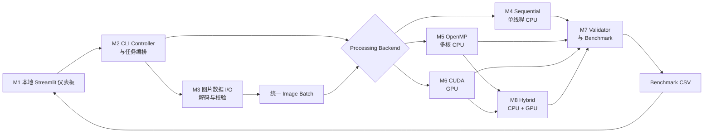

# 技术架构文档

## 1. 项目定位

ParallelPix 是一个并行计算课程期末项目。系统以跨境电商商品图片标准化为业务场景，基础验收对同一批图片实现并比较三种计算方式：

1. 单线程 CPU 顺序计算；
2. OpenMP 多核 CPU 并行计算；
3. CUDA GPU 并行计算。

在三种独立后端完成后，M8 进一步把同一批图片拆分给 OpenMP 与 CUDA 并发执行，作为第四种可选 CPU-GPU Hybrid 异构计算方式。

核心研究问题是：批量处理商品图片时，OpenMP 和 CUDA 相对于单线程 CPU 能获得多少性能提升，数据规模、CPU 线程数和 GPU 数据传输如何影响结果，以及 CPU/GPU 同时工作是否能进一步缩短纯 CUDA 时间。

## 2. 项目范围

项目包含本地图片批量读取、中心裁剪、缩放、亮度调整、半透明水印、输出一致性验证和性能报告。

项目不包含对外 Web 前端、后端 API、数据库、电商交易功能、AI 模型或外部服务。项目包含一个仅在本机运行的 Python Streamlit 性能仪表板，用于启动已编译的命令行程序、查看运行状态和浏览 CSV 结果；它不是被测计算的一部分。首版也不包含 Spark、Kafka、Hadoop 等分布式系统。OpenMP 与 CUDA 作为课程要求中的两个计算组件，实施前应向教师确认该组合符合要求。M8 是基础验收后的可选扩展，不替代独立 OpenMP/CUDA 结果。

## 3. 技术选型

| 技术 | 用途 | 约束 |
|------|------|------|
| C++17 | 公共流程、数据结构和顺序基线 | 所有后端共享数据模型 |
| OpenMP | 共享内存 CPU 并行 | 可配置线程数 |
| CUDA C++ | GPU 像素级并行 | 需要 NVIDIA GPU |
| OpenCV core/imgcodecs | M3 图片解码、编码和临时容器 | vcpkg 固定版本；不暴露到公共模型，不调用现成图片处理算法 |
| CMake | 构建管理 | 统一 Release 配置 |
| Python、Streamlit、Pandas、Plotly | 本地性能仪表板、命令启动和交互式图表 | 不参与被测计算 |

## 4. 总体架构



系统采用“Controller 编排 + 公共流程 + 可替换计算后端”。M2 只负责参数校验和调用顺序，加载、配置、验证、计时和报告只实现一次。M4～M6 独立后端负责相同的像素计算，M8 组合 M5/M6 进行任务级异构调度，保证所有配置使用相同处理语义。

## 5. 图片处理流水线

```text
输入图片
  → 计算中心裁剪区域
  → 双线性插值缩放到统一尺寸
  → 调整亮度
  → 右下角叠加半透明水印
  → 输出标准化图片
```

- 中心裁剪只计算采样区域，不生成中间文件；
- 双线性缩放是主要计算瓶颈，每个输出像素读取四个相邻输入像素；
- 亮度调整对每个颜色通道执行乘法和 0～255 限幅；
- 水印保持原尺寸，在距右边和下边各 32px 处使用 Alpha Blending；
- 默认输出尺寸为 1024×1024，亮度系数为 1.10，水印透明度为 0.35；
- 缩放、亮度和混合均使用最近整数舍入，并将结果钳制到 0～255。

## 6. 核心模块

| 模块 | 职责 | 依赖 |
|------|------|------|
| M1 本地性能仪表板 UI | 启动预定义 Benchmark 命令、展示状态并读取 CSV 图表 | Python、Streamlit、Pandas、Plotly |
| M2 CLI Controller 与任务编排 | 解析和校验参数，选择后端并编排 M3～M8 | C++ |
| M3 图片数据 I/O | 扫描、排序、解码、校验并保存图片 | OpenCV |
| M4 公共处理模型与 Sequential | 保存共享配置、定义处理语义并提供单线程基线 | C++ |
| M5 OpenMP 后端 | 使用多核 CPU 处理图片或输出行 | OpenMP |
| M6 CUDA 后端 | 管理显存、数据传输、Kernel 和 CUDA 降级 | CUDA |
| M7 验证与 Benchmark | 比较像素结果，执行测量、统计并生成 CSV | C++ |
| M8 CPU-GPU Hybrid | 按比例划分图片，并发调用 OpenMP/CUDA 并按原序合并 | M5、M6、M7 |

异常处理、日志、资源释放和降级属于横切能力，由发生错误的模块负责产生具体错误，M2 负责统一传递为日志和进程退出码。

M4 与 M6 共享批次预检，处理入口为：

```text
prepare_processing_batch(input_images, watermark, config)
  -> BatchPreparationResult

process_batch(input_images, watermark, config)
  -> BatchProcessingResult

cuda::Processor::process_batch(
  input_images, watermark, config, requested_batch_size)
  -> cuda::ProcessingResult
```

M7 已负责按实验配置选择后端、计时和包装运行时生命周期。当前注册 Sequential 与 CUDA；M5 后续通过 `IBackendExecutor` 接入。`BackendAvailability` 区分构建未包含后端与运行时无设备，`BackendExecution` 向 M7 返回实际 CUDA 批大小和可选分阶段时间。

## 7. 并行设计

### 7.1 M4 Sequential

- 使用普通 C++ 循环逐张、逐像素处理；
- 禁止使用 OpenMP 和 OpenCV 现成处理函数；
- Sequential 目标不链接 OpenMP 或 OpenCV，也不创建工作线程；
- 与 OpenMP 版本使用相同编译优化级别；
- 作为正确性参考和性能基线。

### 7.2 M5 OpenMP

- 优先按图片并行，线程写入互不重叠的输出内存；
- 图片数量较少时可以按输出行并行；
- 首版不使用嵌套并行；
- 水印和配置只读共享；
- 测试 1、2、4、8 及设备支持的最大线程数。

### 7.3 M6 CUDA

- 使用 `16×16` 二维 block，`grid.z` 对应图片，一个 GPU 线程负责一个输出像素的三个 BGR 通道；
- 单一融合 Kernel 完成半像素双线性采样、亮度调整和水印混合；
- 变长输入和描述符连续打包，固定尺寸输出连续排列；
- 单 stream 复用输入、输出、描述符、水印和 Alpha 显存；
- CUDA Event 分别累计 Host-to-Device、Kernel 和 Device-to-Host 时间；
- 首次显存分配失败时批大小减半并从头重试一次；
- 所有 CUDA API、Kernel 启动和同步都检查错误；
- 完整设计见 [M6 CUDA 后端设计](../design/M6%20CUDA后端设计.md)。

### 7.4 M8 CPU-GPU Hybrid（计划）

- 以图片为不可重叠任务单元，按 CPU 比例进行确定性均匀交错分区；
- CPU 分支调用 M5 OpenMP，GPU 分支调用 M6 CUDA，两个分支在时间上重叠；
- 保存原始索引并在汇合点恢复输入顺序；
- 任一分支失败则整个 Hybrid 配置失败，不降级伪装成纯后端结果；
- 完整 wall-clock 记录任务划分、并发执行和结果合并，CUDA Event 仍只描述 GPU 子集；
- 完成后的静态轨迹分别展示 Hybrid CPU、Hybrid GPU 和总体完成进度；
- 完整设计见 [M8 CPU-GPU 混合后端设计](../design/M8%20CPU-GPU混合后端设计.md)。

## 8. 数据与输出

所有独立后端及 Hybrid 子任务统一使用连续的 8 位三通道 BGR 数据：

```text
Image { width, height, channels, stride, source_path, pixels }
Watermark { BGR color image, alpha plane }
```

`Image` 拥有紧密排列的像素数组，`stride = width * 3`。M3 普通图片统一解码为 BGR；水印保留单独 Alpha 平面。OpenCV 类型只存在于 M3 实现内部，M4～M6 通过公共模型访问像素。

Benchmark CSV 至少包含：

```text
run_id, recorded_at_utc, backend, thread_count, cuda_batch_size,
image_count, input_resolution, output_resolution, warmups, repetitions,
compute_ms, compute_min_ms, compute_max_ms, compute_stddev_ms,
end_to_end_ms, end_to_end_min_ms, end_to_end_max_ms, end_to_end_stddev_ms,
images_per_second, megapixels_per_second, speedup, parallel_efficiency,
validation_passed, max_pixel_error, h2d_ms, kernel_ms, d2h_ms
```

每行表示一个已聚合的实验配置，`compute_ms` 和 `end_to_end_ms` 为中位数。不适用于某后端的字段保持为空，不写伪造的零值。

当前已实现 Schema 为27列。M8 计划追加第28列 `hybrid_cpu_share`；M1 将同时接受旧27列与新28列，避免破坏现有 M6/M7 历史结果。

## 9. 性能测量

- 纯计算时间在图片解码后开始，用于比较核心算法；
- 端到端时间包括扫描、解码、计算和编码，CUDA 还包括数据传输；
- CPU 使用 `std::chrono::steady_clock`，CUDA Kernel 使用 CUDA Event；
- 每组配置预热 2 次，正式运行至少 5 次；
- 主要报告中位数，同时保存最小值、最大值和标准差；
- 实验使用 Release 构建，并记录 CPU、GPU、内存和工具链版本。

计算指标：

```text
Speedup = Sequential Time / Parallel Time
Parallel Efficiency = Speedup / OpenMP Thread Count
Images per Second = Image Count / Execution Time
Megapixels per Second = Total Output Pixels / Execution Time / 1,000,000
```

实验变量包括图片数量、分辨率、OpenMP 线程数、CUDA 批大小，以及 M8 实施后的 Hybrid CPU 工作比例。原始实验记录及结论归档到 `docs/test/`。

## 10. M1 本地性能仪表板

- 通过 `streamlit run tools/dashboard.py` 在本机浏览器打开；不部署为公共 Web 服务；
- 用户可选择已允许的输入目录、后端、OpenMP 线程数、CUDA 批大小和固定测量模式，并启动对应的 CLI Benchmark；M8 实施后再增加 Hybrid CPU 比例；
- 页面显示子进程的运行状态、标准输出和错误输出；命令结束后重新读取结果 CSV；
- 页面以表格和交互式图表展示执行时间、加速比、吞吐量、并行效率，以及 CUDA 的 H2D、Kernel、D2H 时间；
- M8 实施后，完成后的静态轨迹增加 Hybrid CPU/GPU/总体进度，并提供排除 Sequential 的并行后端放大视图；
- 仪表板只在 Benchmark 完成后读取 CSV，不参与任何被测处理、计时和指标计算；性能结论以 C++ Benchmark Runner 写入的原始 CSV 为准；
- CLI 在没有仪表板时也必须可独立运行，便于自动化测试和答辩排障。

## 11. 正确性与错误处理

- Sequential 输出作为参考；
- OpenMP 输出应与 Sequential 完全一致；
- CUDA 允许每通道最大绝对误差不超过 1；
- 正确性比较使用 PNG，避免 JPEG 压缩误差；
- 验证失败的运行不得用于发布加速比；
- 输入目录、图片、参数或输出路径无效时，输出明确错误并以非零状态退出；
- 没有 CUDA 设备时仅禁用 CUDA 后端，CPU 后端仍可运行；
- CUDA 显存不足时减小批大小重试一次，仍失败则终止该后端；
- Hybrid 任一组件不可用时只跳过 Hybrid；任一分支执行失败时整项失败，不伪装成纯后端结果；
- Kernel 或数据复制失败时记录错误并将本次结果标记无效。

## 12. 测试策略

- 单元测试：裁剪坐标、插值、限幅、水印混合和指标公式；
- 边界测试：1×1、2×2、非正方形、全黑、全白和渐变图片；
- 一致性测试：三个后端处理相同输入并逐像素比较；
- 集成测试：从目录读取图片、生成输出和写入 CSV；
- 异常测试：损坏图片、无写权限、非法参数和无 CUDA 设备；
- 性能测试：不同图片数量、分辨率、线程数和批大小。
- M8 扩展测试：任务分区、CPU/GPU 时间重叠、合并顺序、分支错误、CPU 比例和纯后端对照。
- 仪表板测试：验证受支持参数能正确启动 CLI、异常退出时显示错误、运行结束后刷新 CSV 与图表；不使用仪表板页面计入性能结果。

性能测试不设置固定加速倍数作为自动化通过条件，因为结果受硬件和系统负载影响。

## 13. 目录结构与模块边界

```text
ParallelPix/
├── CMakeLists.txt
├── README.md
├── configs/
├── data/samples/
├── docs/{design,plan,tech,test}/
├── include/parallelpix/
│   ├── {cli,planning,controller,pipeline}/  # 已实现的 M2
│   ├── common/{image,processing}.hpp # 已实现的图片模型与处理语义
│   ├── io/image_io.hpp              # 已实现的 M3 I/O 契约
│   ├── sequential/processor.hpp     # 已实现的 M4 Sequential 契约
│   ├── benchmark/                   # 已实现的 M7 执行、验证、统计与报告契约
│   ├── cuda/processor.hpp            # 已实现的 M6 CUDA 公共入口
│   ├── openmp/                       # M5 接口骨架
│   └── hybrid/                       # M8 计划中的异构调度接口
├── src/
│   ├── {cli,planning,controller,pipeline}/  # 已实现的 M2
│   ├── common/{geometry,resize,effects}/
│   ├── io/{catalog,decode,encode}/
│   ├── sequential/processor/
│   ├── openmp/{scheduling,processor}/
│   ├── cuda/{runtime,processor,kernels}/
│   ├── hybrid/{partition,processor}/
│   └── benchmark/{runner,validation,reporting,statistics}/
├── tools/dashboard.py
├── tests/
│   ├── cpp/{cli,planning,controller,pipeline,common,io,sequential,openmp,cuda,benchmark}/
│   ├── fixtures/{images,watermarks}/
│   └── powershell/
├── scripts/
├── results/
└── output/
```

`data/`、`results/` 和 `output/` 中的大文件、编译产物及本地配置必须通过 `.gitignore` 排除。

M3 已作为独立 `parallelpix_io` 静态库加入 CMake。M4 已作为 `parallelpix_processing` 与 `parallelpix_sequential` 静态库实现，覆盖中心裁剪、半像素双线性缩放、亮度、水印混合及整批错误模型。M6 已作为可选 `parallelpix_cuda` 静态库实现，并通过执行器接入 M7。M7 的真实 Pipeline 完成 M3→后端→PNG→验证→统计→CSV，并在后端未注册或运行时不可用时返回可解释的部分成功。`common/` 是后端共享图片模型和处理预检的唯一归属；M5 必须遵守同一规则并通过 M7 执行器接入。M8 后续只组合 M5/M6，不复制像素算法。

## 14. 构建与运行约定

- 使用 CMake 管理构建；
- 使用 vcpkg manifest 固定 OpenCV，并通过 `CMAKE_TOOLCHAIN_FILE` 配置全新构建目录；
- 使用支持 OpenMP 的 MSVC 或 GCC；
- CUDA Toolkit 必须与目标 NVIDIA 驱动兼容；
- `PARALLELPIX_CUDA=AUTO|ON|OFF` 控制可选 CUDA 构建；目标 Blackwell 默认使用架构 120，调用方可覆盖；
- 基准测试只使用 Release 构建；
- 首个可运行版本完成后，在根目录 `README.md` 补充构建命令；
- 本地仪表板使用 `streamlit run tools/dashboard.py` 启动，并在 README 说明 Python 依赖安装方式；
- 不提交 API Key、真实用户图片、机器私有路径或构建产物。

## 15. 验收标准

- 三个后端可以通过统一 CLI 运行；
- Sequential 确认只使用一个 CPU 线程；
- OpenMP 可以配置线程数；
- CUDA 可以配置批大小并报告传输与 Kernel 时间；
- 三个后端输出通过一致性验证；
- M8 扩展实施后，能够证明 CPU/GPU 分支并发、按原序合并并与纯 OpenMP/纯 CUDA 对照；
- Benchmark Runner 可以生成完整 CSV；
- 本地仪表板可以启动 Benchmark、显示命令运行状态并从 CSV 展示性能图表；
- 可以展示执行时间、加速比、吞吐量和并行效率；
- 至少完成三组数据规模和四组 OpenMP 线程数实验；
- 能在 15～20 分钟内完成架构说明、Demo、代码讲解和性能结论。
