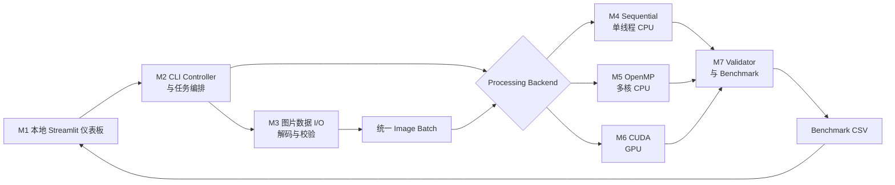

# 技术架构文档

## 1. 项目定位

ParallelPix 是一个并行计算课程期末项目。系统以跨境电商商品图片标准化为业务场景，对同一批图片实现并比较三种计算方式：

1. 单线程 CPU 顺序计算；
2. OpenMP 多核 CPU 并行计算；
3. CUDA GPU 并行计算。

核心研究问题是：批量处理商品图片时，OpenMP 和 CUDA 相对于单线程 CPU 能获得多少性能提升，以及数据规模、CPU 线程数和 GPU 数据传输如何影响结果。

## 2. 项目范围

项目包含本地图片批量读取、中心裁剪、缩放、亮度调整、半透明水印、输出一致性验证和性能报告。

项目不包含对外 Web 前端、后端 API、数据库、电商交易功能、AI 模型或外部服务。项目包含一个仅在本机运行的 Python Streamlit 性能仪表板，用于启动已编译的命令行程序、查看运行状态和浏览 CSV 结果；它不是被测计算的一部分。首版也不包含 Spark、Kafka、Hadoop 等分布式系统。OpenMP 与 CUDA 作为课程要求中的两个计算组件，实施前应向教师确认该组合符合要求。

## 3. 技术选型

| 技术 | 用途 | 约束 |
|------|------|------|
| C++17 | 公共流程、数据结构和顺序基线 | 三个后端共享数据模型 |
| OpenMP | 共享内存 CPU 并行 | 可配置线程数 |
| CUDA C++ | GPU 像素级并行 | 需要 NVIDIA GPU |
| OpenCV | 图片解码、编码和内存容器 | 不调用现成图片处理算法 |
| CMake | 构建管理 | 统一 Release 配置 |
| Python、Streamlit、Pandas、Plotly | 本地性能仪表板、命令启动和交互式图表 | 不参与被测计算 |

## 4. 总体架构



系统采用“Controller 编排 + 公共流程 + 可替换计算后端”。M2 只负责参数校验和调用顺序，加载、配置、验证、计时和报告只实现一次，三个后端仅负责相同的像素计算，保证测试条件一致。

## 5. 图片处理流水线

```text
输入图片
  → 计算中心裁剪区域
  → 双线性插值缩放到统一尺寸
  → 调整亮度
  → 右下角叠加半透明水印
  → 输出标准化图片
```

- 中心裁剪只计算采样区域，不生成中间文件；
- 双线性缩放是主要计算瓶颈，每个输出像素读取四个相邻输入像素；
- 亮度调整对每个颜色通道执行乘法和 0～255 限幅；
- 水印使用 Alpha Blending，三个后端使用相同位置和透明度；
- 默认输出尺寸为 1024×1024，亮度系数为 1.10，水印透明度为 0.35。

## 6. 核心模块

| 模块 | 职责 | 依赖 |
|------|------|------|
| M1 本地性能仪表板 UI | 启动预定义 Benchmark 命令、展示状态并读取 CSV 图表 | Python、Streamlit、Pandas、Plotly |
| M2 CLI Controller 与任务编排 | 解析和校验参数，选择后端并编排 M3～M7 | C++ |
| M3 图片数据 I/O | 扫描、排序、解码、校验并保存图片 | OpenCV |
| M4 公共处理模型与 Sequential | 保存共享配置、定义处理语义并提供单线程基线 | C++ |
| M5 OpenMP 后端 | 使用多核 CPU 处理图片或输出行 | OpenMP |
| M6 CUDA 后端 | 管理显存、数据传输、Kernel 和 CUDA 降级 | CUDA |
| M7 验证与 Benchmark | 比较像素结果，执行测量、统计并生成 CSV | C++ |

异常处理、日志、资源释放和降级属于横切能力，由发生错误的模块负责产生具体错误，M2 负责统一传递为日志和进程退出码。

统一后端接口：

```text
initialize(config, watermark)
process_batch(input_images) -> output_images
synchronize()
shutdown()
```

## 7. 并行设计

### 7.1 M4 Sequential

- 使用普通 C++ 循环逐张、逐像素处理；
- 禁止使用 OpenMP 和 OpenCV 现成处理函数；
- 将 OpenCV 内部线程数设置为 1；
- 与 OpenMP 版本使用相同编译优化级别；
- 作为正确性参考和性能基线。

### 7.2 M5 OpenMP

- 优先按图片并行，线程写入互不重叠的输出内存；
- 图片数量较少时可以按输出行并行；
- 首版不使用嵌套并行；
- 水印和配置只读共享；
- 测试 1、2、4、8 及设备支持的最大线程数。

### 7.3 M6 CUDA

- 使用二维线程网格，一个 GPU 线程负责一个输出像素；
- Kernel 完成缩放采样、亮度调整和水印混合；
- 图片按可配置批次传入 GPU，并复用显存缓冲区；
- 分别记录 Host-to-Device、Kernel 和 Device-to-Host 时间；
- 所有 CUDA API 和 Kernel 启动都必须检查错误。

## 8. 数据与输出

三个后端统一使用连续的 8 位三通道 BGR 数据：

```text
Image { width, height, channels, stride, source_path, pixels }
```

Benchmark CSV 至少包含：

```text
run_id, recorded_at_utc, backend, thread_count, cuda_batch_size,
image_count, input_resolution, output_resolution, warmups, repetitions,
compute_ms, compute_min_ms, compute_max_ms, compute_stddev_ms,
end_to_end_ms, end_to_end_min_ms, end_to_end_max_ms, end_to_end_stddev_ms,
images_per_second, megapixels_per_second, speedup, parallel_efficiency,
validation_passed, max_pixel_error, h2d_ms, kernel_ms, d2h_ms
```

每行表示一个已聚合的实验配置，`compute_ms` 和 `end_to_end_ms` 为中位数。不适用于某后端的字段保持为空，不写伪造的零值。

## 9. 性能测量

- 纯计算时间在图片解码后开始，用于比较核心算法；
- 端到端时间包括扫描、解码、计算和编码，CUDA 还包括数据传输；
- CPU 使用 `std::chrono::steady_clock`，CUDA Kernel 使用 CUDA Event；
- 每组配置预热 2 次，正式运行至少 5 次；
- 主要报告中位数，同时保存最小值、最大值和标准差；
- 实验使用 Release 构建，并记录 CPU、GPU、内存和工具链版本。

计算指标：

```text
Speedup = Sequential Time / Parallel Time
Parallel Efficiency = Speedup / OpenMP Thread Count
Images per Second = Image Count / Execution Time
Megapixels per Second = Total Output Pixels / Execution Time / 1,000,000
```

实验变量包括图片数量、分辨率、OpenMP 线程数和 CUDA 批大小。原始实验记录及结论归档到 `docs/test/`。

## 10. M1 本地性能仪表板

- 通过 `streamlit run tools/dashboard.py` 在本机浏览器打开；不部署为公共 Web 服务；
- 用户可选择已允许的输入目录、后端、OpenMP 线程数、CUDA 批大小和重复次数，并启动对应的 CLI Benchmark；
- 页面显示子进程的运行状态、标准输出和错误输出；命令结束后重新读取结果 CSV；
- 页面以表格和交互式图表展示执行时间、加速比、吞吐量、并行效率，以及 CUDA 的 H2D、Kernel、D2H 时间；
- 仪表板只在 Benchmark 完成后读取 CSV，不参与任何被测处理、计时和指标计算；性能结论以 C++ Benchmark Runner 写入的原始 CSV 为准；
- CLI 在没有仪表板时也必须可独立运行，便于自动化测试和答辩排障。

## 11. 正确性与错误处理

- Sequential 输出作为参考；
- OpenMP 输出应与 Sequential 完全一致；
- CUDA 允许每通道最大绝对误差不超过 1；
- 正确性比较使用 PNG，避免 JPEG 压缩误差；
- 验证失败的运行不得用于发布加速比；
- 输入目录、图片、参数或输出路径无效时，输出明确错误并以非零状态退出；
- 没有 CUDA 设备时仅禁用 CUDA 后端，CPU 后端仍可运行；
- CUDA 显存不足时减小批大小重试一次，仍失败则终止该后端；
- Kernel 或数据复制失败时记录错误并将本次结果标记无效。

## 12. 测试策略

- 单元测试：裁剪坐标、插值、限幅、水印混合和指标公式；
- 边界测试：1×1、2×2、非正方形、全黑、全白和渐变图片；
- 一致性测试：三个后端处理相同输入并逐像素比较；
- 集成测试：从目录读取图片、生成输出和写入 CSV；
- 异常测试：损坏图片、无写权限、非法参数和无 CUDA 设备；
- 性能测试：不同图片数量、分辨率、线程数和批大小。
- 仪表板测试：验证受支持参数能正确启动 CLI、异常退出时显示错误、运行结束后刷新 CSV 与图表；不使用仪表板页面计入性能结果。

性能测试不设置固定加速倍数作为自动化通过条件，因为结果受硬件和系统负载影响。

## 13. 建议目录结构

```text
ParallelPix/
├── CMakeLists.txt
├── README.md
├── configs/
├── data/samples/
├── docs/{design,plan,tech,test}/
├── include/parallelpix/
├── src/{cli,common,sequential,openmp,cuda}/
├── tools/dashboard.py
├── tests/
├── scripts/
├── results/
└── output/
```

`data/`、`results/` 和 `output/` 中的大文件、编译产物及本地配置必须通过 `.gitignore` 排除。

## 14. 构建与运行约定

- 使用 CMake 管理构建；
- 使用支持 OpenMP 的 MSVC 或 GCC；
- CUDA Toolkit 必须与目标 NVIDIA 驱动兼容；
- 基准测试只使用 Release 构建；
- 首个可运行版本完成后，在根目录 `README.md` 补充构建命令；
- 本地仪表板使用 `streamlit run tools/dashboard.py` 启动，并在 README 说明 Python 依赖安装方式；
- 不提交 API Key、真实用户图片、机器私有路径或构建产物。

## 15. 验收标准

- 三个后端可以通过统一 CLI 运行；
- Sequential 确认只使用一个 CPU 线程；
- OpenMP 可以配置线程数；
- CUDA 可以配置批大小并报告传输与 Kernel 时间；
- 三个后端输出通过一致性验证；
- Benchmark Runner 可以生成完整 CSV；
- 本地仪表板可以启动 Benchmark、显示命令运行状态并从 CSV 展示性能图表；
- 可以展示执行时间、加速比、吞吐量和并行效率；
- 至少完成三组数据规模和四组 OpenMP 线程数实验；
- 能在 15～20 分钟内完成架构说明、Demo、代码讲解和性能结论。
