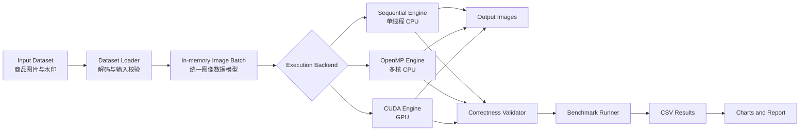

# ParallelPix 技术架构文档

## 1. 文档信息

| 项目 | 内容 |
|---|---|
| 项目名称 | ParallelPix |
| 英文全称 | Parallel Acceleration of E-commerce Product Image Processing Using OpenMP and CUDA |
| 文档版本 | 1.0 |
| 文档日期 | 2026-07-24 |
| 项目类型 | 并行计算课程期末项目 |
| 核心技术 | C++、OpenMP、CUDA、OpenCV |

## 2. 项目概述

ParallelPix 是一个面向跨境电商商品图片标准化场景的并行计算实验项目。系统对一批商品图片执行相同的标准化操作，并实现三种计算后端：

1. 单线程 CPU 顺序实现；
2. OpenMP 多核 CPU 实现；
3. CUDA GPU 实现。

项目使用相同的输入、算法参数和输出格式比较三种实现的执行时间、加速比、吞吐量和可扩展性。跨境电商只作为业务背景，项目不开发完整电商平台，重点集中在并行算法、性能测量和结果分析。

### 2.1 业务问题

跨境电商卖家可能一次上传大量尺寸、亮度和格式不同的商品图片。图片正式发布到商品详情页、搜索列表和海外站点之前，通常需要经过统一处理，例如：

- 裁剪为统一比例；
- 缩放到平台规定尺寸；
- 调整亮度；
- 添加半透明平台水印。

传统顺序程序逐张、逐像素处理图片，数据量增加后处理时间会线性增长。图片之间以及同一图片的大部分输出像素之间相互独立，因此适合使用多核 CPU 和 GPU 进行并行加速。

### 2.2 核心研究问题

本项目回答以下问题：

> 对大量商品图片执行相同标准化操作时，OpenMP 多核 CPU 和 CUDA GPU 相对于单线程 CPU 能获得多少性能提升？不同数据规模和线程数量如何影响加速比与并行效率？

## 3. 项目目标与非目标

### 3.1 项目目标

- 建立可复现的单线程 CPU 性能基线；
- 使用 OpenMP 实现共享内存并行处理；
- 使用 CUDA 实现 GPU 像素级并行处理；
- 保证三种实现的算法和输出结果等价；
- 分别测量纯计算时间与端到端时间；
- 比较执行时间、加速比、吞吐量和 OpenMP 并行效率；
- 分析 CPU 线程调度、磁盘 I/O 和 GPU 数据传输开销；
- 提供适合 15～20 分钟现场展示的命令行 Demo 和性能图表。

### 3.2 非目标

首个版本明确不包含以下内容：

- 电商网站、用户系统、订单或支付功能；
- 数据库和分布式存储；
- Spark、Kafka、Hadoop 或跨节点计算；
- AI 模型训练、推理或外部大模型 API；
- 商品识别、推荐系统或内容生成；
- 复杂桌面图形界面。

如果教师明确要求必须包含分布式计算，应单独评估将项目调整为 “OpenMP + Spark”，而不是直接在当前范围上叠加第三套复杂系统。

## 4. 课程要求覆盖

| 课程要求 | ParallelPix 对应实现 |
|---|---|
| 清晰的问题定义 | 批量商品图片顺序处理耗时较长 |
| 计算或数据处理问题 | 对大量图片执行逐像素标准化操作 |
| 并行计算的收益说明 | 图片和输出像素之间大部分相互独立 |
| 数据规模或计算强度 | 改变图片数量、分辨率和重复次数 |
| 顺序 CPU 基线 | 单线程 C++ 实现 |
| 计算瓶颈识别 | 缩放插值、亮度调整和水印混合 |
| CPU 并行计算 | OpenMP 共享内存并行 |
| GPU 加速 | CUDA Kernel |
| 至少两个计算组件 | OpenMP + CUDA |
| 架构图 | 输入、预处理、三种计算后端、验证和报告 |
| 执行时间与加速比 | Benchmark Runner 统一测量 |
| CPU 与 GPU 比较 | 顺序 CPU、OpenMP、CUDA 横向比较 |
| 吞吐量 | 每秒处理图片数和每秒处理百万像素数 |
| 可扩展性 | 不同线程数、图片数量和分辨率实验 |

本项目不覆盖分布式系统以及本地计算与分布式计算的比较。开始实施前，团队应向教师确认 OpenMP 与 CUDA 可以作为所要求的两个计算组件。

## 5. 总体技术架构



系统采用“共享接口、多个计算后端”的结构。图片加载、参数配置、结果验证和性能报告由公共模块负责，只有核心像素计算根据后端分别实现。这种设计可以减少重复代码，并保证性能对比基于同一组输入和算法。

## 6. 图片标准化流水线

首个版本采用固定的处理流水线：

```text
输入图片
  → 中心裁剪为正方形
  → 双线性插值缩放到 1024 × 1024
  → 亮度调整
  → 右下角叠加半透明水印
  → 输出标准化图片
```

### 6.1 中心裁剪

中心裁剪只计算输入区域的起始位置和边长，不需要创建独立的中间图片。缩放阶段直接从该区域采样。

### 6.2 双线性缩放

每个输出像素根据映射坐标读取四个相邻输入像素，并通过双线性插值计算结果。该步骤计算量稳定、输出像素之间相互独立，是主要的并行计算对象。

### 6.3 亮度调整

每个颜色通道乘以固定系数，并将结果限制在 0～255：

```text
output = clamp(input × brightness_factor, 0, 255)
```

默认亮度系数为 `1.10`，可通过命令行配置。

### 6.4 水印混合

水印区域使用 Alpha Blending：

```text
output = alpha × watermark + (1 - alpha) × image
```

默认透明度为 `0.35`。水印位置固定在输出图片右下角，位置和边距由统一配置计算，三个后端不得使用不同参数。

## 7. 核心模块设计

### 7.1 Command Line Interface

负责解析运行参数并启动指定计算后端。

建议命令格式：

```text
parallelpix --backend sequential --input data/input --output output/sequential
parallelpix --backend openmp --threads 8 --input data/input --output output/openmp
parallelpix --backend cuda --batch-size 16 --input data/input --output output/cuda
parallelpix benchmark --config configs/benchmark.json
```

关键参数包括：

- `--backend`：`sequential`、`openmp` 或 `cuda`；
- `--input`：输入图片目录；
- `--output`：输出图片目录；
- `--threads`：OpenMP 线程数；
- `--batch-size`：CUDA 每批处理的图片数量；
- `--width`、`--height`：目标图片尺寸；
- `--brightness`：亮度系数；
- `--watermark-alpha`：水印透明度；
- `--compute-only`：是否只测量核心计算阶段。

### 7.2 Dataset Loader

职责：

- 扫描输入目录；
- 过滤支持的 JPG、JPEG 和 PNG 文件；
- 使用 OpenCV 将图片解码为 8 位三通道 BGR 数据；
- 检查空文件、损坏图片和不支持的格式；
- 生成稳定排序的输入列表；
- 加载水印并转换为统一像素格式。

OpenCV 只负责图片解码、编码和基础数据容器，不直接调用其缩放、亮度或水印函数完成核心算法。

### 7.3 Processing Configuration

所有计算后端共享同一个只读配置对象，至少包含：

- 输出宽度和高度；
- 亮度系数；
- 水印透明度、边距和位置；
- OpenMP 线程数；
- CUDA 批大小；
- 是否包含 I/O 计时；
- 预热次数和正式测量次数。

### 7.4 Processing Backend Interface

三个计算后端实现相同的抽象接口：

```text
initialize(configuration, watermark)
process_batch(input_images) -> output_images
synchronize()
shutdown()
```

公共接口确保 Dataset Loader、Correctness Validator 和 Benchmark Runner 不依赖具体计算技术。

### 7.5 Sequential Engine

顺序版本是性能基线，要求：

- 使用单个 CPU 线程；
- 使用普通 C++ 循环实现全部核心算法；
- 禁止 OpenMP；
- 禁止调用 OpenCV 已优化的处理函数；
- 运行基准测试时将 OpenCV 内部线程数设置为 1；
- 编译优化参数与 OpenMP 版本保持一致。

顺序版本的循环结构也是 OpenMP 和 CUDA 版本的语义参考。

### 7.6 OpenMP Engine

OpenMP 版本与顺序版本使用相同公式和数据格式。

推荐并行策略：

- 外层按图片并行，使用动态调度减少不同输入尺寸造成的负载不均衡；
- 当批次图片数量较少时，可按输出行或输出像素并行；
- 首个版本不使用嵌套并行区域；
- 线程只写入各自负责的输出内存，避免数据竞争；
- 水印和配置作为共享只读数据。

实验线程数建议为：

```text
1、2、4、8，以及不超过物理/逻辑核心上限的最大线程数
```

### 7.7 CUDA Engine

CUDA 版本采用二维线程网格。每个 GPU 线程负责一个输出像素，执行双线性采样、亮度调整和必要的水印混合。

推荐流程：

1. 将解码后的输入批次复制到 GPU；
2. 在 GPU 上分配输出缓冲区；
3. 启动标准化 Kernel；
4. 使用 CUDA Event 记录纯 Kernel 时间；
5. 将结果复制回 CPU；
6. 由公共输出模块保存图片。

首个版本使用可配置的小批次，避免一次将全部图片加载到显存。每个批次完成后复用已分配的 GPU 缓冲区，降低频繁分配和释放的开销。

必须检查以下 CUDA 错误：

- 设备是否可用；
- 显存分配是否成功；
- 主机与设备之间的数据复制是否成功；
- Kernel 启动和同步是否成功。

### 7.8 Correctness Validator

性能结果只有在输出正确的前提下才有效。验证模块以顺序 CPU 输出为参考，比较 OpenMP 和 CUDA 输出：

- 输出尺寸必须完全相同；
- 输出通道数必须相同；
- OpenMP 输出应与顺序输出完全一致；
- CUDA 因浮点计算和取整差异，默认允许每通道最大绝对误差不超过 1；
- 记录最大误差、平均误差和不一致像素比例；
- 验证失败时，该次性能结果标记为无效。

建议使用无损 PNG 进行正确性比较，避免 JPEG 压缩误差影响验证。

### 7.9 Benchmark Runner

Benchmark Runner 统一执行三种后端，避免手工测试引入不一致。

职责：

- 固定输入数据和参数；
- 执行预热；
- 重复运行测试；
- 收集各阶段耗时；
- 计算中位数和离散程度；
- 计算加速比、吞吐量和并行效率；
- 将结果写入 CSV。

### 7.10 Report Generator

报告模块可使用 Python、Pandas 和 Matplotlib 读取 CSV，仅用于生成图表，不参与被测计算。

建议生成：

- 三种后端执行时间柱状图；
- OpenMP 线程数与加速比折线图；
- 图片数量与吞吐量折线图；
- 不同分辨率下 CPU 与 GPU 的性能对比图；
- CUDA Kernel 时间与端到端时间对比图。

## 8. 数据模型

### 8.1 Image

```text
Image
├── width: int
├── height: int
├── channels: int
├── stride: size_t
├── source_path: string
└── pixels: contiguous uint8 buffer
```

输入和输出像素使用连续内存，便于 CPU 缓存访问和 CUDA 批量传输。首个版本统一使用三通道 8 位 BGR 格式。

### 8.2 Benchmark Record

CSV 每行表示一次正式测量：

```text
timestamp
backend
thread_count
cuda_batch_size
image_count
input_resolution
output_resolution
total_pixels
decode_ms
host_to_device_ms
compute_ms
device_to_host_ms
encode_ms
end_to_end_ms
images_per_second
megapixels_per_second
speedup
parallel_efficiency
validation_passed
max_pixel_error
```

不适用于某个后端的字段保留为空，不使用伪造的零值。

## 9. 性能测量方法

### 9.1 测量模式

系统提供两种测量模式。

**纯计算模式**

- 在计时前完成图片解码；
- 顺序和 OpenMP 只测核心像素循环；
- CUDA 分别记录 Host-to-Device、Kernel 和 Device-to-Host 时间；
- 用于比较算法本身的计算性能。

**端到端模式**

- 包含图片扫描、解码、计算和编码保存；
- 用于反映实际批量处理任务的总体性能；
- CUDA 端到端时间必须包含数据传输。

### 9.2 计时工具

- CPU：`std::chrono::steady_clock`；
- CUDA Kernel：CUDA Event；
- CUDA 端到端：CPU 稳定时钟；
- 每组实验先预热 2 次，再正式运行至少 5 次；
- 主要报告中位数，同时保存最小值、最大值和标准差。

### 9.3 性能指标

**加速比**

```text
Speedup = Sequential Time / Parallel Time
```

**OpenMP 并行效率**

```text
Parallel Efficiency = Speedup / Thread Count
```

**图片吞吐量**

```text
Images per Second = Image Count / Execution Time
```

**像素吞吐量**

```text
Megapixels per Second = Total Output Pixels / Execution Time / 1,000,000
```

## 10. 实验矩阵

建议使用以下实验组合，最终根据设备能力适当缩减：

| 变量 | 建议取值 |
|---|---|
| 图片数量 | 100、500、1000 |
| 输入分辨率 | 1280×720、1920×1080、3840×2160 |
| 输出分辨率 | 512×512、1024×1024 |
| OpenMP 线程数 | 1、2、4、8、最大线程数 |
| CUDA 批大小 | 1、4、8、16 |
| 正式重复次数 | 5 |

为了控制仓库体积，测试数据集不直接提交大量原始图片。仓库应提供小型示例数据和数据准备说明。正式性能实验使用相同图片的确定性复制或预先准备的数据清单，并在报告中说明真实文件数与重复工作负载的构造方式。

## 11. 错误处理

| 场景 | 处理方式 |
|---|---|
| 输入目录不存在 | 输出明确错误并以非零状态退出 |
| 没有可处理图片 | 不启动基准测试，提示用户检查数据 |
| 图片损坏 | 记录文件名；默认跳过并汇总数量 |
| 水印文件无效 | 启动失败，避免三个后端参数不一致 |
| 输出目录不可写 | 在计算前失败，避免测试完成后丢失结果 |
| OpenMP 线程数非法 | 使用错误信息拒绝运行 |
| 没有 CUDA 设备 | CUDA 后端标记为不可用，不影响 CPU 后端 |
| CUDA 显存不足 | 减小批大小并重试一次；仍失败则终止该后端 |
| CUDA Kernel 失败 | 输出 CUDA 错误信息并将本次结果标记为无效 |
| 输出验证失败 | 不计算或不发布该次加速比 |

## 12. 测试策略

### 12.1 单元测试

- 中心裁剪坐标计算；
- 双线性插值边界像素；
- 亮度计算与 0～255 限幅；
- 水印区域与 Alpha 混合；
- 命令行参数解析；
- 性能指标公式。

### 12.2 后端一致性测试

使用小型确定性图片测试三种后端：

- 1×1、2×2 和非正方形图片；
- 全黑、全白和固定颜色图片；
- 渐变图片；
- 水印完全在边界内的图片；
- 亮度调整产生上下限截断的图片。

### 12.3 集成测试

- 从目录读取多张图片并生成完整输出；
- 三种后端输出文件数量一致；
- Benchmark CSV 字段完整；
- 损坏图片不会导致整个进程无提示崩溃；
- 没有 CUDA 设备时 CPU 测试仍可运行。

### 12.4 性能回归测试

性能会受到机器负载影响，因此自动测试不要求固定加速倍数，只检查：

- 计时结果为正数；
- 所有正式运行都有结果；
- 同一配置不存在数量级异常波动；
- 输出验证通过；
- 测试报告包含设备和编译环境信息。

## 13. 建议代码结构

```text
ParallelPix/
├── CMakeLists.txt
├── README.md
├── configs/
│   └── benchmark.json
├── data/
│   ├── samples/
│   └── watermark.png
├── docs/
│   └── technical-architecture.md
├── include/
│   └── parallelpix/
│       ├── image.hpp
│       ├── processing_config.hpp
│       ├── processing_backend.hpp
│       ├── benchmark.hpp
│       └── validator.hpp
├── src/
│   ├── cli/
│   │   └── main.cpp
│   ├── common/
│   │   ├── dataset_loader.cpp
│   │   ├── image_writer.cpp
│   │   ├── benchmark.cpp
│   │   └── validator.cpp
│   ├── sequential/
│   │   └── sequential_backend.cpp
│   ├── openmp/
│   │   └── openmp_backend.cpp
│   └── cuda/
│       ├── cuda_backend.cpp
│       └── standardize_kernel.cu
├── tests/
│   ├── unit/
│   └── integration/
├── scripts/
│   └── generate_charts.py
├── results/
│   ├── raw/
│   └── charts/
└── output/
    ├── sequential/
    ├── openmp/
    └── cuda/
```

`data`、`results` 和 `output` 中的大文件应通过 `.gitignore` 排除，只提交必要的小型样例、配置和最终图表。

## 14. 构建与运行环境

建议环境：

- 操作系统：Windows 11 或 Linux；
- 编译器：支持 OpenMP 的 MSVC 或 GCC；
- 构建系统：CMake；
- CUDA Toolkit：与目标 NVIDIA GPU 驱动兼容的版本；
- OpenCV：仅用于图片 I/O 和数据容器；
- Python 3：仅用于生成实验图表；
- Git：使用 feature 分支开发。

最终报告必须记录：

- CPU 型号、核心数和线程数；
- GPU 型号和显存；
- 内存容量；
- 操作系统；
- 编译器及版本；
- CUDA Toolkit 版本；
- Release 编译参数。

性能实验只使用 Release 构建，不使用 Debug 构建结果。

## 15. 演示方案

15～20 分钟现场展示建议按以下顺序：

1. 说明商品图片标准化的业务问题；
2. 展示顺序、OpenMP 和 CUDA 三种架构；
3. 解释为什么图片和像素可以并行处理；
4. 讲解三种实现中对应的核心循环或 Kernel；
5. 对同一批图片运行三个后端；
6. 展示输出图片的一致性验证结果；
7. 展示执行时间、加速比和吞吐量图表；
8. 分析 OpenMP 扩展性、GPU 数据传输和 I/O 瓶颈；
9. 总结不同规模下 CPU 与 GPU 的适用场景。

## 16. 风险与应对

| 风险 | 影响 | 应对措施 |
|---|---|---|
| 目标机器没有 NVIDIA GPU | 无法运行 CUDA Demo | 提前确认设备；保存可复现实验结果与录屏 |
| OpenCV 内部优化污染基线 | 性能比较不公平 | 核心算法自行实现，并关闭 OpenCV 内部线程 |
| 图片 I/O 掩盖计算加速 | GPU 端到端加速不明显 | 同时报告纯计算和端到端时间 |
| GPU 数据传输开销过大 | 小数据集 CUDA 可能更慢 | 测试不同批大小和数据规模并解释交叉点 |
| 三种输出存在差异 | 性能结果无效 | 自动执行逐像素正确性验证 |
| 测试数据过少 | 难以观察并行收益 | 增加图片数量、分辨率或确定性重复次数 |
| 项目范围继续扩大 | 无法按期完成 | 坚持非目标列表，首版不增加网站或分布式组件 |

## 17. 验收标准

项目达到以下条件即视为技术完成：

- 三种后端均可通过统一命令运行；
- 顺序版本确认只使用一个 CPU 线程；
- OpenMP 版本可以配置线程数；
- CUDA 版本在支持的 NVIDIA GPU 上成功运行；
- 三种后端对同一输入生成尺寸一致、误差符合阈值的输出；
- Benchmark Runner 可以生成完整 CSV；
- 能计算并展示执行时间、加速比、吞吐量和 OpenMP 并行效率；
- 能分别报告纯计算与端到端结果；
- 至少完成三组数据规模和四组 OpenMP 线程数实验；
- 架构图、代码演示和实验结论可以在 15～20 分钟内讲清楚。

## 18. 待教师确认事项

在进入实现前，团队应向教师确认以下唯一关键事项：

> Can we use OpenMP CPU parallelism and CUDA GPU acceleration as the two required components, without implementing a distributed system?

如果答案为“可以”，本架构保持不变；如果答案为“必须使用分布式系统”，需要重新确定技术范围，不直接将 Spark 作为附加功能塞入当前架构。
